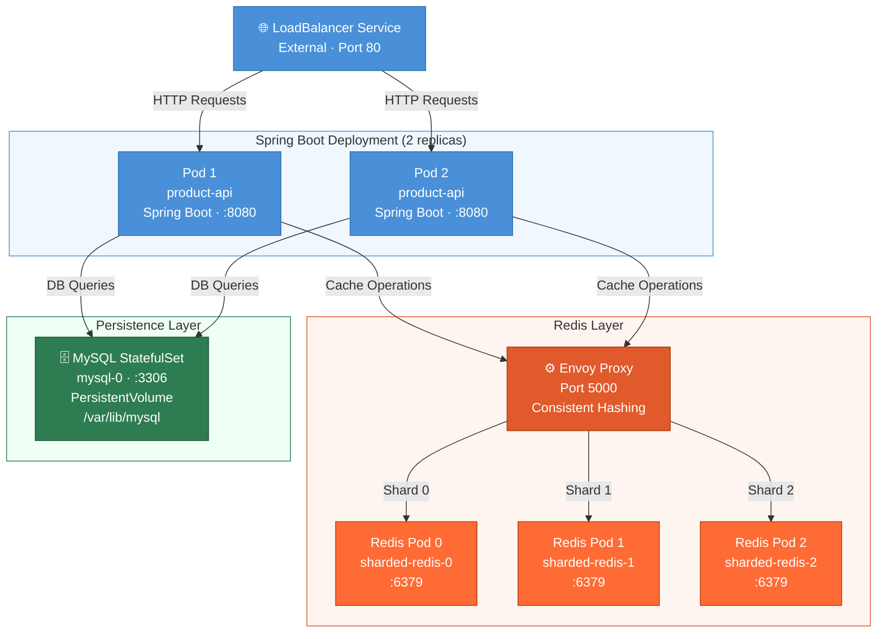

# Kubernetes Introduction

## K8s

Kubernetes is a _Container **orchestration** system_.

**Docker** wraps applications into boxes with all what is needed for the applications to run.
The primary purpose of a container is to define and enforce boundaries around specific resources
and to provide separation of concerns.

**Kubernetes** manages the boxes.

Advantages of using k8s
- **Resilience**: Ensures that applications continue running even if some containers or nodes fail. Kubernetes automatically restarts failed containers and reschedules workloads.
- **Scalability**: Supports horizontal scaling (adding more instances of an application) and high availability, ensuring applications can handle increasing workloads efficiently.
- **Self-healing**: Detects and replaces failed containers automatically, reschedules pods if a node goes down, and restarts unresponsive applications.
- **Versioning**: Enables automated rollouts and rollbacks, ensuring seamless updates and the ability to revert changes if needed.
- **Service discovery and load balancing**: Kubernetes automatically assigns DNS names to services and distributes traffic evenly across available pods to optimize performance.
- **Security**: Provides built-in secret management and configuration management, ensuring sensitive data (e.g., API keys, passwords) is securely handled without exposing them in application code.

A Kubernetes cluster consists of:
- **Master Node** (Control Plane) – manages the cluster and schedules applications.
- **Worker Nodes** – run the containerized applications.

### Types of resources in K8s
#### Pods
- The smallest and simplest object managed by Kubernetes.
- Each pod contains one or more containers that share resources and networking.
- Pods are ephemeral resources.
- Pods are created and destroyed to match the desired state of your cluster as specified in Deployments.

A Pod represents a single instance of a running process in a cluster. Each pod runs
one or more containers (usually Docker containers) and provides an environment
for them to share resources (storage, networking, and configurations).

A Pod has a unique IP address inside the cluster. It can be scheduled on any node in the Kubernetes cluster.
It can restart containers if they fail (but does not self-heal; Deployments handle that).

**A Pod contains**:
- **Containers**: The actual applications/processes running inside the Pod.
- **Storage (Volumes)**: Shared storage for all containers in the Pod.
- **Network**: Each Pod gets its own IP address, and containers inside the Pod can communicate via `localhost`.
- **Configuration**: Environment variables, secrets, and `ConfigMaps`.

A Pod goes through the following **phases**:
- **Pending** – Pod is created but waiting for resources.
- **Running** – Pod is up and running with all containers.
- **Succeeded** – Pod has completed execution (for jobs, batch tasks).
- **Failed** – One or more containers in the Pod failed.
- **Unknown** – The Pod state cannot be determined (possible network issue).

```bash
kubectl get pods
kubectl describe pod my-pod
kubectl logs my-pod
```

#### Services
- Provide a stable access point to a set of Pods, even if the underlying infrastructure changes.
- Services use label selectors to identify which Pods should receive traffic.
- Services enable service discovery - other applications can find your service by name.
- Services provide load balancing across multiple Pod replicas.
- The set of Pods targeted by a Service is usually determined by a selector.
- Service types:
  - **ClusterIP** (default) – accessible only within the cluster. This is the default that is used if you don't explicitly specify a type for a Service. You can expose the Service to the public internet using an Ingress.
  
    Examples: A backend service that should only be accessible by frontend pods. Database services accessed only by application pods.
  - **NodePort** – exposes the application on a fixed port (static) on each node.

    Traffic sent to http://\<NodeIP>:\<NodePort> gets routed to the service.

    Examples: Local Kubernetes (Minikube), Development and testing environments, quick demos or proof-of-concepts 
    
  - **LoadBalancer** – integrates with cloud load balancers for external access.
    
    Examples: Production workloads on cloud providers, stable external IP.

  - **Headless (None)**  -  Directly access pods via DNS, without having to go through a load balancer. Does not assign a virtual IP. 
    Instead of providing a single virtual IP address for the service, a headless service creates a DNS record for each pod associated with the service.

  - Examples: A Redis or MySQL cluster where clients need direct access to individual pods. Complex load-balancing. Clients need to discover and connect to specific pod instances and stateful applications (databases, caches, message queues)

To sum up:
- Every Pod gets its own IP inside the cluster.
- Containers in the same Pod can communicate via localhost.
- Pods talk to each other using Services (e.g., ClusterIP, NodePort, LoadBalancer).

In this project:
- `product-api` uses a **LoadBalancer** Service for external access in Minikube.
- `envoy` uses a **ClusterIP** Service because only in-cluster clients need it.
- `redis` uses a **headless Service** because Envoy needs to reach specific shard pods.
- `mysql` is also exposed through a Service name, though for this single-node demo a standard `ClusterIP` would also be acceptable.

#### ConfigMaps & Secrets
- `ConfigMap` – stores configuration settings such as environment variables and config files.
- `Secret` – securely stores sensitive data like credentials and connection settings.

#### Deployments & StatefulSets
- `Deployment` – used for stateless applications (do not store data between restarts) that can be replaced freely. A Deployment in Kubernetes manages the scaling, updating, and rollback
  of application pods. It ensures the desired number
  of replicas are running and automatically replaces failed pods.

- `StatefulSet` – used for stateful applications that need stable identities and storage, such as databases (Redis, MySQL).

In this project:
- `product-api` and `envoy` are `Deployments`.
- `mysql` and `sharded-redis` are `StatefulSets`.

---

## Application Architecture

This repository demonstrates a Kubernetes migration of the project **docker-introduction**:
- `product-api` is deployed as a `Deployment` with 2 replicas.
- `mysql` is deployed as a `StatefulSet` with persistent storage.
- `sharded-redis` is deployed as a `StatefulSet` with 3 pods and stable DNS names.
- `envoy` is deployed as a separate `Deployment` that proxies Redis traffic on port `5000`.
- **Secrets** are used for connection settings and credentials.
- **Prometheus and Grafana** are used for monitoring and metrics visualization.

When **pods** are stateless and identical, we use a **Deployment** to manage them.
When **pods** need persistent identity or storage we use **StetefulSet**.

**MySQL as a StatefulSet**: stable identity and persistent storage (`mysql/mysql-statefulset.yaml`).

**Spring Boot app as Deployment**: The SpringBoot deployment remains stateless (`springbootapp/springbootapp-deployment.yaml`).
The Spring Boot app talks to `mysql` and `envoy` through Kubernetes **Services**.

**Sharded-redis** (`redis/redis-statefulset.yaml`): Envoy needs to reach individual Redis pods by DNS name.

**Envoy as a dedicated proxy layer** (`redis/envoy-deployment.yaml`) is a reasonable way to hide shard selection from the Spring Boot application.


---

## Design patterns

### Sidecar Pattern

The Sidecar pattern involves running multiple containers within the same Pod, where the main container handles the primary application logic, while sidecar containers provide auxiliary services.
Containers share:
- the same network namespace,
- the same lifecycle,
- and optionally shared volumes.

For this repository, the most concrete sidecar use case is **monitoring Redis shards** by adding a `redis-exporter` container to the same Pod as each Redis container.

### Ambassador Pattern

The Ambassador pattern uses a secondary container as a proxy between the main application container and external services. This pattern helps manage outbound traffic, enabling functionalities like request routing, load balancing, retries, and failover handling.

For example, an Ambassador container can intercept API requests from the primary application and forward them to different backend services based on predefined rules. This enhances flexibility, resilience, and maintainability by offloading networking concerns from the main application. A Spring Boot microservice could have an Envoy proxy as an ambassador, managing all outbound traffic to backend services.

The Ambassador pattern uses a proxy between the main application and external services.

In this repository, Envoy is deployed as a standalone shared proxy rather than as a Pod-local ambassador. It still centralizes outbound cache traffic, which makes it ambassador-like from an architecture point of view, but not a literal sidecar/ambassador container inside the Spring Boot Pod.

---

## Caching

### Redis
Caching stores frequently accessed data in an in-memory data store (Redis) to improve performance and reduce database load.

**Cache prefetching**:
An entire product catalog can be pre-cached in Redis, and the application can perform any product query on Redis similar to the primary database.

**Cache-aside pattern**:
Redis is filled on demand, based on whatever search parameters are requested by the frontend.

Steps taken in the cache-aside pattern when there is a cache miss:
1. An application requests data from the backend.
2. The backend checks whether the data is available in Redis.
3. Data is not found, so the data is fetched from the database.
4. The data returned from the database is stored in Redis.
5. The data is returned to the client.

---

### Envoy

Envoy is a high-performance proxy designed for service-to-service communication in modern distributed architectures.

In this project, Envoy provides:
- a stable endpoint (`envoy:5000`) for the Spring Boot app,
- request routing toward the Redis shards,
- MAGLEV load balancing / consistent hashing behavior across the configured shard endpoints.
**MAGLEV consistent hashing**: Envoy uses the MAGLEV algorithm as its `lb_policy` when
routing across Redis shards. MAGLEV is a consistent hashing scheme developed by Google.
With consistent hashing, adding or removing a shard only remaps a small fraction of the
keys rather than rehashing the entire key space. This is important for cache stability:
a rolling Redis scale-up causes far fewer cache misses than a simple modulo-based hash would.

**Dynamic shard discovery with `STRICT_DNS`**: the configmap file `redis/envoy-configmap.yaml` points
to the headless `redis` Service instead of listing individual pod names such as
`sharded-redis-static.redis`. With `STRICT_DNS`, Envoy re-resolves the DNS name periodically
and picks up every A record returned by the headless Service — one per running pod.
Scaling the Redis StatefulSet up or down is therefore reflected automatically without
any Envoy config change or rollout. The file `redis/envoy-configmap-static.yaml` retains
a three-endpoint configuration for reference.

**Redis Cluster vs Envoy sharding**: Redis Cluster is the native Redis solution for
horizontal sharding. It manages slot assignment, rebalancing, and failover internally
across nodes. The approach used here — routing to standalone Redis pods through Envoy —
is simpler to understand and sufficient for a demo, but it does not replicate Redis Cluster
behavior: there is no automatic slot rebalancing, no cross-shard key migration, and no
built-in failover. For production workloads that require true distributed Redis, Redis
Cluster or a managed equivalent such as AWS ElastiCache (cluster mode) is the recommended path.

## Demo
### Storage hierarchy

```text
StatefulSet (mysql)
│
│ volumeClaimTemplates:
│   - metadata:
│       name: mysql-data
│
▼
PersistentVolumeClaim (mysql-data-mysql-0)
│
│ Bound to
│
▼
PersistentVolume (auto-provisioned)
│
│ Backed by
│
▼
Physical Storage (Cloud Disk / Local Volume)
│
▼
/var/lib/mysql (mounted in Pod)
```

### Kubernetes resources

```text
StatefulSet (mysql)          ← mysql/mysql-statefulset.yaml
│
▼
Service (mysql)              ← mysql/mysql-service.yaml
│
▼
mysql pod (mysql-0)
```

```text
StatefulSet (sharded-redis)  ← redis/redis-statefulset.yaml
│                               redis/redis-statefulset-exporter.yaml  (Step 12, with sidecar)
▼
Service (redis)              ← redis/redis-service.yaml  (headless, for DNS only)
│
▼
redis pods (sharded-redis-0, sharded-redis-1, sharded-redis-2)
  └─ redis-exporter sidecar  (port 9121, scraped by Prometheus via pod annotations)
```

```text
ConfigMap (envoy-config)     ← redis/envoy-configmap.yaml  (dynamic, STRICT_DNS)
│                               redis/envoy-configmap-static.yaml  (static, reference only)
▼
Deployment (envoy)           ← redis/envoy-deployment.yaml
│
▼
Service (envoy)              ← redis/envoy-service.yaml
│
▼
envoy pods (envoy-***)
```

```text
Deployment (product-api)     ← springbootapp/springbootapp-deployment.yaml
│
▼
Service (product-api)        ← springbootapp/springbootapp-service.yaml
│
▼
Spring Boot pods (product-api-***, product-api-***)
```

### Step 1
Choose the Kubernetes environment for testing.

Install [minikube](https://minikube.sigs.k8s.io/docs/) and run:

```bash
minikube start
minikube dashboard
```

### Step 2
Create the Secret resources storing MySQL and Redis connection data.

```bash
kubectl create -f secrets.yaml
```

Comment:
- `secrets.yaml` lives at the project root because its credentials are shared across components (MySQL and Redis/Envoy).
- `mysql-credentials` stores the database password and database name.
- `redis-credentials` stores the host `envoy` and port `5000`, so the Spring Boot app connects to Envoy rather than directly to a Redis shard.

### Step 3
Create the MySQL StatefulSet and Service.

```bash
kubectl create -f mysql/mysql-statefulset.yaml
kubectl create -f mysql/mysql-service.yaml
```

Comment:
- `mysql/mysql-statefulset.yaml` includes `volumeClaimTemplates`, so storage is persisted across pod restarts.
- Readiness and liveness probes are configured. Kubernetes has information about whether Redis is truly ready to serve traffic.
- The `mysql/mysql-service.yaml` Service is currently headless. That still works in this single-instance setup because the service name resolves to the only MySQL pod.

Useful checks:

```bash
kubectl get pods -l app=mysql
kubectl describe pod mysql-0
kubectl get pvc
```

### Step 4
Create the Redis StatefulSet.

```bash
kubectl create -f redis/redis-statefulset.yaml
```

Comment:
- Kubernetes creates pods with stable names such as `sharded-redis-0`, `sharded-redis-1`, and `sharded-redis-2`.
- These stable names are required because Envoy refers to each shard explicitly through DNS.
- The current `redis/redis-statefulset.yaml` is intentionally minimal: it has no probes and no persistent volume claims.
- `redis/redis-statefulset-exporter.yaml` is the extended variant that adds the `redis-exporter` sidecar; it is used in Step 12.

### Step 5
Create the headless Service for the Redis shards.

```bash
kubectl create -f redis/redis-service.yaml
```

Comment:
- The headless Service (`clusterIP: None`) does not load-balance traffic through a virtual IP.
- Instead, it creates DNS entries for each Redis pod.
- That allows Envoy to reach specific shard endpoints such as `sharded-redis-1.redis` in the static config, or discover all pods automatically with `STRICT_DNS` in `redis/envoy-configmap.yaml`.

Useful checks:

```bash
kubectl get svc
kubectl get pods -l app=redis
kubectl get endpoints redis
```

### Step 6
Create the Envoy configuration.

```bash
kubectl create -f redis/envoy-configmap.yaml
```

Comment:
- `redis/envoy-configmap.yaml` is the **dynamic** variant: it uses `STRICT_DNS` pointing at the headless `redis` Service so Envoy discovers all shard pods automatically.
- `redis/envoy-configmap-static.yaml` is the **static** variant retained for reference: it lists `sharded-redis-0.redis`, `sharded-redis-1.redis`, and `sharded-redis-2.redis` explicitly. If the Redis shard count changes, this config must be updated manually.

The DNS format used in the static variant:

```text
<pod-name>.<service-name>
```

Example:

```text
sharded-redis-1.redis
```

### Step 7
Create the Envoy deployment and in-cluster Service.

```bash
kubectl create -f redis/envoy-deployment.yaml
kubectl create -f redis/envoy-service.yaml
```

Comment:
- Envoy is deployed as a standalone proxy service, not as a sidecar container in the Spring Boot pod.
- The Spring Boot app uses the `envoy` Service name as its Redis endpoint.

Useful checks:

```bash
kubectl get pods -l app=envoy
kubectl logs deploy/envoy
```

### Step 8
Create the Spring Boot application deployment and external Service.

```bash
kubectl create -f springbootapp/springbootapp-deployment.yaml
kubectl create -f springbootapp/springbootapp-service.yaml
```

Comment:
- The application image is currently `fmiawbd/product-service` as defined in `springbootapp/springbootapp-deployment.yaml`.
- The app receives `MYSQL_*` and `REDIS_*` settings through environment variables.

Useful checks:

```bash
kubectl get pods -l app=product-api
kubectl logs deploy/product-api
kubectl describe service product-api
```

### Step 9
If you need to recreate the Spring Boot pods after a config or image change:

```bash
kubectl rollout restart deployment product-api
```

To access the app from Minikube:

```bash
minikube service product-api
```

Comment:
- `product-api` is a `LoadBalancer` Service.
- minikube tunnel is a command  that allows LoadBalancer-type services in a Minikube cluster 
to be accessible from local machine by creating a network route.

- In a real K8s cluster (in a cloud environment), a LoadBalancer service gets an external 
IP from a cloud provider (AWS, GCP, Azure). In Minikube, there’s no cloud provider 
to assign an external IP, so minikube tunnel acts as a workaround by: creating a network route to access LoadBalancer services and assigning a real external IP to the service.

### Step 10
Test the application requests.

```bash
curl -X POST http://127.0.0.1:port/api/products \
  -H "Content-Type: application/json" \
  -d '{
    "name": "Laptop",
    "description": "High-performance laptop",
    "price": 1299.99,
    "quantity": 50
  }'
```

```bash
curl http://127.0.0.1:port/api/products/1
```

```bash
curl -X PUT http://127.0.0.1:port/api/products/1 \
  -H "Content-Type: application/json" \
  -d '{
    "name": "Gaming Laptop",
    "description": "High-end gaming laptop",
    "price": 1599.99,
    "quantity": 30
  }'
```

Comment:
- The first `GET` should be a cache miss.
- A repeated `GET` for the same ID should become a cache hit if the application-level Redis integration is working as expected.
- If requests fail, inspect `kubectl logs deploy/product-api`, `kubectl logs deploy/envoy`, and the Redis/MySQL pod status.

---

## Monitoring Redis with Prometheus and Grafana

This section extends the Kubernetes migration with observability for the Redis layer.

### Helm

Helm is a package manager for Kubernetes that facilitates deployment and management of
pre-packaged applications. It is especially useful when an application is made up of
multiple Kubernetes objects such as Deployments, Services, ConfigMaps, and Secrets.

Applications are packaged as **charts** containing all necessary configuration files and
setting options.

The **Helm client** is used to:
- manage charts locally and manage local repositories,
- interact with remote Helm repositories,
- install and upgrade applications in a Kubernetes cluster.

Behind the scenes, the **Helm Library** combines Helm templates with user-supplied
configuration to create the final Kubernetes manifests. The Helm Library communicates
directly with the Kubernetes API server.

Chart components:
- **`Chart.yaml`** – chart metadata: name, version, description, and dependencies on other charts.
- **`templates/`** – Kubernetes resource definitions rendered with Go templating.
- **`values.yaml`** + `values.schema.json` – default configuration settings that can be
  overridden at install time with `-f myvalues.yaml` or `--set key=value`.

### Prometheus

Prometheus is an open-source systems monitoring and alerting toolkit.
It collects and stores metrics as time series data — each metric is stored with the
timestamp at which it was recorded, alongside optional key-value pairs called **labels**.

Prometheus **scrapes** metrics from instrumented targets at a configured interval, either
directly from the target or via a push gateway for short-lived jobs.
It stores all scraped samples locally and can run rules over this data to aggregate new
time series or generate alerts.

**Grafana** (or any other API consumer) can be used to visualize the collected data.


### Redis exporter

Prometheus scrapes HTTP endpoints that expose metrics in Prometheus format.
Redis itself does not expose those metrics in the format Prometheus expects.
A **Redis exporter** acts as an adapter:
- it connects to Redis,
- collects Redis stats,
- exposes them over HTTP for Prometheus.

**Sidecar pattern design** run one exporter **inside each Redis Pod**.
- main container: Redis shard,
- sidecar container: `redis-exporter` for that shard.

This gives shard-level visibility and keeps the exporter next to the Redis instance it monitors.

### Step 11
Install Prometheus and Grafana with Helm using predefined values files.

Prometheus scrape config and Grafana datasource + dashboard are
provisioned automatically at install time from `prometheus/prometheus-values.yaml` and `grafana/grafana-values.yaml`.

First ensure kubectl is pointing to minikube and add the Helm repositories:

```bash
kubectl config use-context minikube
kubectl cluster-info
```

```bash
helm repo add prometheus-community https://prometheus-community.github.io/helm-charts
helm repo add grafana https://grafana.github.io/helm-charts
helm repo update
```

Install Prometheus with the predefined scrape config:

```bash
helm upgrade --install prometheus prometheus-community/prometheus -f prometheus/prometheus-values.yaml
```

Install Grafana with the predefined Prometheus datasource and Redis dashboard:

```bash
helm upgrade --install grafana grafana/grafana -f grafana/grafana-values.yaml
```

Comment:
- `helm upgrade --install` is idempotent: it installs on first run and upgrades on subsequent runs.
- If you had a previous Prometheus install with stale targets, this replaces the config cleanly.
- The Redis scrape job is embedded in `prometheus/prometheus-values.yaml`.


Useful checks:

```bash
helm list
kubectl get pods
kubectl get svc
kubectl get configmap prometheus-server -o yaml | findstr "job_name"
```

### Step 12
Add a Redis exporter sidecar to each Redis shard.

Minimal sidecar container example:

```yaml
- name: redis-exporter
  image: oliver006/redis_exporter:latest
  ports:
    - containerPort: 9121
      name: redis-exporter
  args:
    - --redis.addr=redis://localhost:6379
```

Comment:
- The exporter talks to `localhost:6379` because it shares the same Pod network namespace as the Redis container.
- Prometheus does pod-level discovery.

After updating the StatefulSet, apply the change:

```bash
kubectl apply -f redis/redis-statefulset-exporter.yaml
kubectl rollout status statefulset/sharded-redis
```

Useful checks:

```bash
kubectl get pods -l app=redis
kubectl describe pod sharded-redis-0
```

### Step 13

Open the Prometheus UI and verify the Redis targets.

```bash
minikube service prometheus-server
```

Then open:

```text
http://127.0.0.1:<port>/targets
```

You should see Redis exporter targets for the shard pods.

Useful queries to try in Prometheus:

```text
up{job="redis"}
redis_up
redis_connected_clients
redis_memory_used_bytes
redis_commands_processed_total
```

### Step 14
Open Grafana and verify the Redis dashboard.

Access Grafana:

```bash
minikube service grafana
```

Get the admin password:

```bash
kubectl get secret grafana -o jsonpath="{.data.admin-password}" | %{[System.Text.Encoding]::UTF8.GetString([System.Convert]::FromBase64String($_))}
```

- The Prometheus datasource (`http://prometheus-server`) is already provisioned.
- The `Redis Shards Overview` dashboard is already available under **Dashboards**.
- Login with `admin` / password from the command above and open the dashboard directly.

The provisioned dashboard includes these panels:

| Panel | Query |
|---|---|
| Shard Up | `redis_up` |
| Connected Clients | `redis_connected_clients` |
| Used Memory | `redis_memory_used_bytes` |
| Commands / s | `rate(redis_commands_processed_total[1m])` |
| Keys per DB | `redis_db_keys` |


## Exercises

---

### Exercise 1 — Rebuild and push the application image

When the application code changes, the Docker image must be rebuilt and pushed to a registry
before Kubernetes can pick it up.

```bash
docker build -t <your-dockerhub-username>/product-service:latest .
docker push <your-dockerhub-username>/product-service:latest
```

Then trigger a rolling restart so Kubernetes pulls the new image:

```bash
kubectl rollout restart deployment/product-api
kubectl rollout status deployment/product-api
```

**Image pull policy** controls when Kubernetes pulls a new image from the registry.
In `springbootapp/springbootapp-deployment.yaml`:

```yaml
containers:
  - name: product-api
    image: <your-dockerhub-username>/product-service:latest
    imagePullPolicy: Always
```

| Policy | Behaviour |
|---|---|
| `Always` | Always pull from the registry on every pod start. Use during development with `latest`. |
| `IfNotPresent` | Pull only if the image is not already cached on the node. Suitable for tagged releases. |
| `Never` | Never pull — image must already exist on the node. Useful for local Minikube builds. |


Set `imagePullPolicy: Never` in the deployment manifest.

---

### Exercise 2 — Monitor the Spring Boot application


Extend monitoring so Prometheus also scrapes Spring Boot application metrics.

Unlike Redis, Spring Boot can expose Prometheus metrics **directly** through Actuator + Micrometer —
no separate exporter container is needed.

The pattern is:
- the app produces metrics,
- Actuator exposes them over HTTP at `/actuator/prometheus`,
- Prometheus scrapes that endpoint.

#### Gradle dependencies

Add to `build.gradle`:

```gradle
dependencies {
    implementation 'org.springframework.boot:spring-boot-starter-actuator'
    runtimeOnly 'io.micrometer:micrometer-registry-prometheus'
}
```

**Actuator** provides production-ready HTTP endpoints for health, info, and metrics.
**Micrometer** formats those metrics in Prometheus exposition format so Prometheus can scrape them.

#### Application configuration

Expose the Prometheus endpoint in `application.properties`:

```properties
management.endpoints.web.exposure.include=prometheus
management.endpoint.prometheus.access=read_only
```

Typical endpoint:

```text
/actuator/prometheus
```

#### Prometheus scrape job

Add a scrape job for Spring Boot pods to `prometheus/prometheus-values.yaml`
under `serverFiles.prometheus.yml.scrape_configs`:

```yaml
- job_name: 'spring-boot-app'
  metrics_path: '/actuator/prometheus'
  kubernetes_sd_configs:
    - role: pod
  relabel_configs:
    - source_labels: [__meta_kubernetes_pod_label_app]
      action: keep
      regex: product-api
```

Then apply the change:

```bash
helm upgrade prometheus prometheus-community/prometheus -f prometheus/prometheus-values.yaml
```

Verify at `http://127.0.0.1:<port>/targets` that the `spring-boot-app` job is UP.

 
Possible metrics to explore:

```text
http_server_requests_seconds_count
jvm_memory_used_bytes
process_uptime_seconds
```

---

### Exercise 3 — Create a Grafana dashboard for HTTP requests and cache metrics

Build a Grafana dashboard to visualize Spring Boot and cache behaviour.

#### Panels to add

| Panel | Query | What it shows |
|---|---|---|
| Request rate | `rate(http_server_requests_seconds_count[1m])` | Requests per second |
| Error rate | `rate(http_server_requests_seconds_count{status=~"5.."}[1m])` | 5xx errors per second |
| Latency p99 | `histogram_quantile(0.99, rate(http_server_requests_seconds_bucket[5m]))` | 99th percentile response time |
| JVM heap | `jvm_memory_used_bytes{area="heap"}` | JVM heap consumption |
| Cache hits | metric depends on cache implementation | Cache hit counter |
| Cache misses | metric depends on cache implementation | Cache miss counter |

#### How to provision the dashboard via `grafana/grafana-values.yaml`

Add the dashboard JSON under the `dashboards` key
so it is provisioned automatically at startup:

```yaml
dashboards:
  default:
    spring-boot-overview:
      json: |
        { ... paste exported dashboard JSON here ... }
```

Build the dashboard panels manually in the Grafana UI.

Export it: **Dashboard → Share → Export → Save to file**.

Paste the JSON into `grafana/grafana-values.yaml` under `dashboards.default`.

Re-run `helm upgrade grafana grafana/grafana -f grafana/grafana-values.yaml`.

---

### Exercise 4 — Add Grafana alert notifications

Configure a **contact point** by adding a `grafana.ini` section and a notifiers block
to `grafana/grafana-values.yaml`:

```yaml
grafana.ini:
  smtp:
    enabled: true
    host: smtp.example.com:587
    user: alerts@example.com
    password: secret
    from_address: alerts@example.com
    from_name: Grafana
```

For Slack, use a webhook contact point instead:

```yaml
alerting:
  contactpoints.yaml:
    apiVersion: 1
    contactPoints:
      - orgId: 1
        name: slack-alerts
        receivers:
          - uid: slack-receiver
            type: slack
            settings:
              url: https://hooks.slack.com/services/YOUR/WEBHOOK/URL
              title: "{{ template \"default.title\" . }}"
              text: "{{ template \"default.message\" . }}"
```

Then define an alert rule on a dashboard panel:
- set an **Evaluate every** interval,
- set a **condition** threshold (e.g. `redis_up == 0`),
- assign the contact point `slack-alerts`.

Apply the updated values:

```bash
helm upgrade grafana grafana/grafana -f grafana/grafana-values.yaml
```

## Cleanup

### Kubernetes resources

```bash
kubectl delete deploy product-api
kubectl delete deploy envoy
kubectl delete sts sharded-redis
kubectl delete sts mysql
kubectl delete svc product-api
kubectl delete svc envoy
kubectl delete svc redis
kubectl delete svc mysql
kubectl delete cm envoy-config
kubectl delete secret mysql-credentials
kubectl delete secret redis-credentials
kubectl delete pvc --all
```

### Monitoring resources

```bash
helm uninstall prometheus
helm uninstall grafana
```

Comment:
- `prometheus/prometheus-values.yaml` and `grafana/grafana-values.yaml` are local config files — they do not need to be deleted,
  but they should be kept out of version control if they contain real passwords.

### Useful inspection commands before cleanup

```bash
kubectl get configmaps
kubectl get deployments
kubectl get statefulsets
kubectl get services
kubectl get pods
kubectl get pvc
kubectl get secrets
helm list
```

### References

[1] https://kubernetes.io/docs/concepts/

[2] https://redis.io/learn/howtos/solutions/microservices/caching

[3] https://kubernetes.io/docs/tasks/access-application-cluster/ingress-minikube/

[4] https://prometheus.io/docs/introduction/overview/

[5] https://grafana.com/docs/grafana/latest/

[6] https://helm.sh/docs/topics/charts/

### Development Notes

Architecture documentation, Redis and Kubernetes configuration developed with assistance from Claude AI (Anthropic).

```text
Anthropic. (2026). Claude [claude-sonnet-4-5-20250929].
https://claude.ai
```

Kubernetes manifests also developed
with assistance from GitHub Copilot (Microsoft).

```text
Microsoft. (2026). GitHub Copilot [GPT-4o].
https://github.com/features/copilot
```


