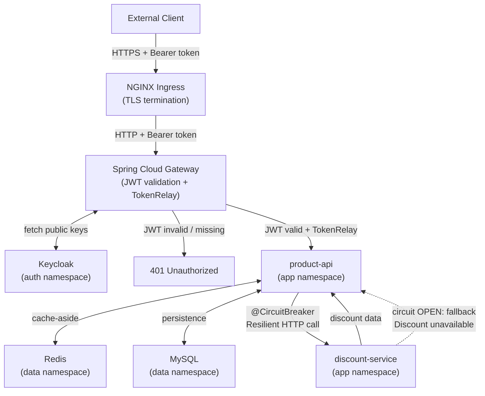
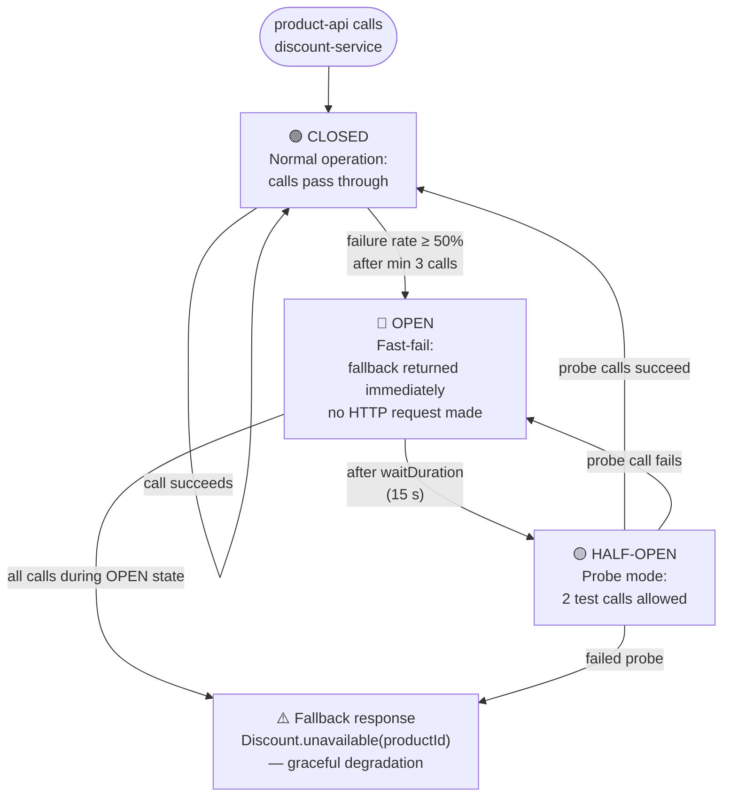

# Migrating product-api to use discount-service

## Overview

This migration adds a new `discount-service` microservice and wires `product-api`
to call it using the **aggregation pattern**, protected by a **Resilience4j circuit breaker**.

The observable demo is the circuit state machine:
**CLOSED → OPEN (fallback) → HALF-OPEN → CLOSED**

```
Client
  │  GET /api/products/{id}/enriched + Bearer token
  ▼
Gateway  (JWT validation + TokenRelay)
  │
  ▼
product-api
  │  RestClient call — @CircuitBreaker
  ├── CLOSED  ──▶  discount-service  ──▶  { percentage: 10, description: "Summer Sale" }
  │
  └── OPEN    ──▶  fallback()  ──▶  { percentage: null, description: "Discount service unavailable" }
```

---

## Project Components



---

## Circuit Breaker Pattern



### Configuration reference

```properties
resilience4j.circuitbreaker.instances.discount-service.sliding-window-size=5
resilience4j.circuitbreaker.instances.discount-service.minimum-number-of-calls=3
resilience4j.circuitbreaker.instances.discount-service.failure-rate-threshold=50
resilience4j.circuitbreaker.instances.discount-service.wait-duration-in-open-state=15s
resilience4j.circuitbreaker.instances.discount-service.permitted-number-of-calls-in-half-open-state=2
resilience4j.circuitbreaker.instances.discount-service.automatic-transition-from-open-to-half-open-enabled=true
```

| Parameter | Value | Meaning |
|-----------|-------|---------|
| `sliding-window-size` | 5 | Track the last 5 calls |
| `minimum-number-of-calls` | 3 | Need at least 3 calls before evaluating failure rate |
| `failure-rate-threshold` | 50 | Open if ≥ 50% of calls in window fail |
| `wait-duration-in-open-state` | 15s | Stay OPEN for 15 s before allowing probe calls |
| `permitted-number-of-calls-in-half-open-state` | 2 | 2 probe calls before deciding CLOSED or OPEN |
| `automatic-transition-from-open-to-half-open-enabled` | true | No manual trigger needed — transitions automatically |

---

## Code changes summary

The following changes apply to the [K8s_ProductApiCircuitBreaker](https://github.com/iuliabanu/awbd2026/tree/main/K8s_ProductApiGateway) project.

| Project                | File | Change |
|------------------------|------|--------|
| `discount-service-app` | entire project | **NEW** |
| `product-api-app`      | `build.gradle` | Added `resilience4j-spring-boot3`, `spring-boot-starter-aop` |
| `product-api-app`      | `client/DiscountClient.java` | **NEW** — `@CircuitBreaker`, `RestClient`, fallback |
| `product-api-app`      | `model/Discount.java` | **NEW** — DTO mirroring discount-service response |
| `product-api-app`      | `model/EnrichedProduct.java` | **NEW** — aggregated Product + Discount + discountedPrice |
| `product-api-app`      | `service/ProductService.java` | Added `getEnrichedProduct()` |
| `product-api-app`      | `controller/ProductController.java` | Added `GET /{id}/enriched` |
| `product-api-app`      | `application.properties` | Added `discount.service.uri`, Resilience4j config |
| root                   | `docker-compose.yml` | Added `discount-service`, `DISCOUNT_SERVICE_URI` in product-api |

---

## Code changes

### Step 1 — `build.gradle` — add Resilience4j and AOP

Add the following two dependencies to the `dependencies` block in `product-api/build.gradle`:

```groovy
implementation 'io.github.resilience4j:resilience4j-spring-boot3:2.3.0'
implementation 'org.aspectj:aspectjweaver:1.9.22'
```

---

### Step 2 — `model/Discount.java` — new DTO

Create `src/main/java/com/awbd/productservice/model/Discount.java`.

This DTO mirrors the discount-service response. Keeping it separate means
the two services are independently deployable with no shared library.

```java
package com.awbd.productservice.model;

import lombok.AllArgsConstructor;
import lombok.Data;
import lombok.NoArgsConstructor;

import java.time.LocalDate;

@Data
@NoArgsConstructor
@AllArgsConstructor
public class Discount {

    private Long productId;
    private Double percentage;
    private String description;
    private LocalDate expiryDate;

    /** Fallback value used when the circuit is open or discount-service is down. */
    public static Discount unavailable(Long productId) {
        return new Discount(productId, null, "Discount service unavailable", null);
    }
}
```

---

### Step 3 — `model/EnrichedProduct.java` — aggregated response model

Create `src/main/java/com/awbd/productservice/model/EnrichedProduct.java`.

This is the response body for `GET /api/products/{id}/enriched` — a combination
of the product data and the discount retrieved from discount-service.

```java
package com.awbd.productservice.model;

import lombok.AllArgsConstructor;
import lombok.Data;
import lombok.NoArgsConstructor;

import java.math.BigDecimal;
import java.math.RoundingMode;

@Data
@NoArgsConstructor
@AllArgsConstructor
public class EnrichedProduct {

    private Product product;
    private Discount discount;

    // Pre-computed discounted price — null if discount is unavailable.
    private BigDecimal discountedPrice;

    public static EnrichedProduct of(Product product, Discount discount) {
        BigDecimal discountedPrice = null;

        if (discount != null && discount.getPercentage() != null && discount.getPercentage() > 0) {
            BigDecimal factor = BigDecimal.ONE
                    .subtract(BigDecimal.valueOf(discount.getPercentage() / 100.0));
            discountedPrice = product.getPrice()
                    .multiply(factor)
                    .setScale(2, RoundingMode.HALF_UP);
        }

        return new EnrichedProduct(product, discount, discountedPrice);
    }
}
```

---

### Step 4 — `client/DiscountClient.java` — HTTP client with circuit breaker

Create `src/main/java/com/awbd/productservice/client/DiscountClient.java`.

`@CircuitBreaker` intercepts the method via AOP. On any exception (connection refused,
timeout, 5xx) the failure is recorded against the sliding window. When the failure rate
threshold is reached the circuit opens and subsequent calls go directly to the fallback
without attempting the HTTP request.

```java
package com.awbd.productservice.client;

import com.awbd.productservice.model.Discount;
import io.github.resilience4j.circuitbreaker.annotation.CircuitBreaker;
import org.slf4j.Logger;
import org.slf4j.LoggerFactory;
import org.springframework.beans.factory.annotation.Value;
import org.springframework.stereotype.Component;
import org.springframework.web.client.RestClient;

@Component
public class DiscountClient {

    private static final Logger log = LoggerFactory.getLogger(DiscountClient.class);
    private static final String CB_NAME = "discount-service";

    private final RestClient restClient;

    public DiscountClient(@Value("${discount.service.uri}") String discountServiceUri) {
        this.restClient = RestClient.builder()
                .baseUrl(discountServiceUri)
                .build();
    }

    @CircuitBreaker(name = CB_NAME, fallbackMethod = "getDiscountFallback")
    public Discount getDiscount(Long productId) {
        log.info("Calling discount-service for product ID: {}", productId);
        return restClient.get()
                .uri("/api/discounts/{productId}", productId)
                .retrieve()
                .body(Discount.class);
    }

    /**
     * Fallback invoked when the circuit is open OR when a call fails.
     * Signature must match getDiscount() plus a Throwable parameter.
     */
    private Discount getDiscountFallback(Long productId, Throwable cause) {
        log.warn("Circuit breaker fallback for product ID: {} — cause: {}",
                productId, cause.getMessage());
        return Discount.unavailable(productId);
    }
}
```

The fallback method signature **must exactly match** the original method plus
a `Throwable` at the end. A mismatch causes a `FallbackMethod not found` exception at runtime.

---

### Step 5 — `service/ProductService.java` — add `getEnrichedProduct()`

Inject `DiscountClient` into the existing `ProductService` and add the new method.

```java
// Add import
import com.awbd.productservice.client.DiscountClient;
import com.awbd.productservice.model.Discount;
import com.awbd.productservice.model.EnrichedProduct;
```

Extend the constructor:

```java
private final DiscountClient discountClient;

public ProductService(ProductRepository productRepository,
                      RedisTemplate<String, Object> redisTemplate,
                      DiscountClient discountClient) {
    this.productRepository = productRepository;
    this.redisTemplate = redisTemplate;
    this.discountClient = discountClient;
}
```

Add the new method alongside the existing service methods:

```java
/**
 * Aggregation pattern: fetches the product (cache-aside) then calls
 * discount-service via DiscountClient (circuit-breaker protected).
 * If discount-service is down the call returns Discount.unavailable()
 * and this method still returns a complete EnrichedProduct (graceful degradation).
 */
public Optional<EnrichedProduct> getEnrichedProduct(Long id) {
    return getProductById(id).map(product -> {
        Discount discount = discountClient.getDiscount(id);
        return EnrichedProduct.of(product, discount);
    });
}
```

---

### Step 6 — `controller/ProductController.java` — add enriched endpoint

Add the import and the new handler to the existing `ProductController`:

```java
// Add imports
import com.awbd.productservice.model.EnrichedProduct;
```

```java
/**
 * Aggregation endpoint: returns the product enriched with discount info.
 * If discount-service is down the response still returns 200 with null
 * discount fields (graceful degradation). ROLE_USER or ROLE_ADMIN.
 */
@GetMapping("/{id}/enriched")
public ResponseEntity<EnrichedProduct> getEnrichedProduct(@PathVariable Long id) {
    return productService.getEnrichedProduct(id)
            .map(ResponseEntity::ok)
            .orElse(ResponseEntity.notFound().build());
}
```

---

### Step 7 — `application.properties` — discount URI + Resilience4j config

Append the following to `src/main/resources/application.properties`:

```properties
# Discount service — injected into DiscountClient
# Default points to Docker Compose service name; overridden by K8s env var.
discount.service.uri=${DISCOUNT_SERVICE_URI:http://discount-service:8080}

# Resilience4j circuit breaker — discount-service instance
resilience4j.circuitbreaker.instances.discount-service.sliding-window-size=5
resilience4j.circuitbreaker.instances.discount-service.minimum-number-of-calls=3
resilience4j.circuitbreaker.instances.discount-service.failure-rate-threshold=50
resilience4j.circuitbreaker.instances.discount-service.wait-duration-in-open-state=15s
resilience4j.circuitbreaker.instances.discount-service.permitted-number-of-calls-in-half-open-state=2
resilience4j.circuitbreaker.instances.discount-service.automatic-transition-from-open-to-half-open-enabled=true
```

---

## Build and start locally

> **Before running, complete the following:**
>
> - **`secrets-cert-manager.yaml` and `cert-manager/cluster-issuer.yaml`** — replace the placeholder EAB `hmacKey` and `keyID` values with your own ZeroSSL EAB credentials (obtainable from your ZeroSSL account under *Developer > EAB Credentials for ACME Clients*). [zerossl](https://app.zerossl.com/developer)
> - **Docker image references** — replace `<YOUR_DOCKERHUB_USER>` with your own Docker Hub username in every `docker build` / `docker push` command and in the corresponding Kubernetes deployment manifests before pushing and deploying.

| File | Placeholder |
|------|-------------|
| `secrets-cert-manager.yaml` | `<YOUR_EAB_HMAC_KEY>` |
| `cert-manager/cluster-issuer.yaml` | `<YOUR_EAB_KEY_ID>`, `<YOUR_EMAIL>` |
| `docker-compose.yml` | `<YOUR_DOCKERHUB_USER>` (product-api, gateway, discount-service) |
| `springbootapp/springbootapp-deployment.yaml` | `<YOUR_DOCKERHUB_USER>` |
| `springbootapp/discount-deployment.yaml` | `<YOUR_DOCKERHUB_USER>` |
| `gateway/gateway-deployment.yaml` | `<YOUR_DOCKERHUB_USER>` |

### Build discount-service

```powershell
cd discount-service-app
./gradlew bootJar
docker build -t <YOUR_DOCKERHUB_USER>/discount-service .
docker push <YOUR_DOCKERHUB_USER>/discount-service
cd ..
```

### Rebuild product-api (Resilience4j added)

```powershell
cd product-api-app
./gradlew bootJar
docker build -t <YOUR_DOCKERHUB_USER>/product-service:v3 .
docker push <YOUR_DOCKERHUB_USER>/product-service:v3
cd ..
```

### Rebuild gateway

```powershell
cd gateway-app
./gradlew bootJar
docker build -t <YOUR_DOCKERHUB_USER>/gateway-service .
docker push <YOUR_DOCKERHUB_USER>/gateway-service
cd ..
```

### Start the full stack

```powershell
docker compose up -d
docker compose ps
```


---

## Testing

### Step 1 — Get tokens


Add `keycloak` to hosts file
Run once, as Administrator so token fetch URLs match the `iss` claim that Keycloak embeds inside Docker (`http://keycloak:8080`).

```powershell
Add-Content -Path "C:\Windows\System32\drivers\etc\hosts" -Value "127.0.0.1 keycloak"
```


```powershell
$USER_TOKEN = (Invoke-RestMethod -Method Post `
  -Uri "http://keycloak:8080/realms/demo/protocol/openid-connect/token" `
  -ContentType "application/x-www-form-urlencoded" `
  -Body "client_id=gateway-client&client_secret=changeme-client-secret&grant_type=password&username=testuser&password=password").access_token

$ADMIN_TOKEN = (Invoke-RestMethod -Method Post `
  -Uri "http://keycloak:8080/realms/demo/protocol/openid-connect/token" `
  -ContentType "application/x-www-form-urlencoded" `
  -Body "client_id=gateway-client&client_secret=changeme-client-secret&grant_type=password&username=adminuser&password=password").access_token
```

> **Troubleshooting — unexpected 401**
> Keycloak tokens expire after 5 minutes. If a request that should return `200` returns `401` instead, re-run the token fetch commands above to get a fresh `$USER_TOKEN` / `$ADMIN_TOKEN` and retry.


### Step 2 — Seed some products

```powershell
# Products with IDs 1, 2, 3 have pre-configured discounts in discount-service
Invoke-RestMethod -Method Post -Uri "http://localhost:8082/api/products" `
  -Headers @{ Authorization = "Bearer $ADMIN_TOKEN" } `
  -ContentType "application/json" `
  -Body '{"name":"Laptop","description":"Gaming laptop","price":1299.99,"quantity":10}'

Invoke-RestMethod -Method Post -Uri "http://localhost:8082/api/products" `
  -Headers @{ Authorization = "Bearer $ADMIN_TOKEN" } `
  -ContentType "application/json" `
  -Body '{"name":"Monitor","description":"4K display","price":599.99,"quantity":25}'

Invoke-RestMethod -Method Post -Uri "http://localhost:8082/api/products" `
  -Headers @{ Authorization = "Bearer $ADMIN_TOKEN" } `
  -ContentType "application/json" `
  -Body '{"name":"Keyboard","description":"Mechanical keyboard","price":129.99,"quantity":50}'

# Product 4 — no configured discount
Invoke-RestMethod -Method Post -Uri "http://localhost:8082/api/products" `
  -Headers @{ Authorization = "Bearer $ADMIN_TOKEN" } `
  -ContentType "application/json" `
  -Body '{"name":"Mouse","description":"Wireless mouse","price":49.99,"quantity":100}'


```

### Step 3 — Call the enriched endpoint (circuit CLOSED)

```powershell
# Product 1 — 10% Summer Sale discount
Invoke-RestMethod -Uri "http://localhost:8082/api/products/1/enriched" `
  -Headers @{ Authorization = "Bearer $USER_TOKEN" }
```

Expected response:
```json
{
  "product": { "id": 1, "name": "Laptop", "price": 1299.99 },
  "discount": {
    "productId": 1,
    "percentage": 10.0,
    "description": "Summer Sale",
    "expiryDate": "2025-..."
  },
  "discountedPrice": 1169.99
}
```

```powershell
# Product 4 — no configured discount (0%)
Invoke-RestMethod -Uri "http://localhost:8082/api/products/4/enriched" `
  -Headers @{ Authorization = "Bearer $USER_TOKEN" }
# discountedPrice: null, percentage: 0.0, description: "No discount available"
```

---

## Circuit breaker demo

### Step 1 — Check the circuit is CLOSED

```powershell
Invoke-RestMethod -Uri "http://localhost:8081/actuator/circuitbreakers" `
  -Headers @{ Authorization = "Bearer $USER_TOKEN" } | ConvertTo-Json -Depth 10
```

Expected:
```json
{
  "details": {
    "discount-service": {
      "state": "CLOSED",
      "bufferedCalls": 0,
      "failedCalls": 0,
      "successfulCalls": 3
    }
  }
}
```

### Step 2 — Trip the circuit breaker

Stop discount-service to simulate a failure:

```powershell
docker compose stop discount-service
```

Make 3+ calls to exceed the failure threshold
(`slidingWindowSize=5`, `failureRateThreshold=50%`, `minimumNumberOfCalls=3` —
3 failures out of 3 = 100% > 50%):

```powershell
Invoke-RestMethod -Uri "http://localhost:8082/api/products/1/enriched" -Headers @{ Authorization = "Bearer $USER_TOKEN" }
Invoke-RestMethod -Uri "http://localhost:8082/api/products/1/enriched" -Headers @{ Authorization = "Bearer $USER_TOKEN" }
Invoke-RestMethod -Uri "http://localhost:8082/api/products/1/enriched" -Headers @{ Authorization = "Bearer $USER_TOKEN" }
```

The response is still `200 OK` — degraded but not broken:
```json
{
  "product": { "id": 1, "name": "Laptop", "price": 1299.99 },
  "discount": {
    "productId": 1,
    "percentage": null,
    "description": "Discount service unavailable",
    "expiryDate": null
  },
  "discountedPrice": null
}
```

Confirm the circuit is now OPEN:

```powershell
Invoke-RestMethod -Uri "http://localhost:8081/actuator/circuitbreakers" `
  -Headers @{ Authorization = "Bearer $USER_TOKEN" } | ConvertTo-Json -Depth 10
# "state": "OPEN"
```

Once OPEN, subsequent calls go directly to the fallback without attempting
the HTTP request — **fails fast** instead of waiting for a timeout on every call.

### Step 3 — Observe recovery (HALF-OPEN → CLOSED)

Restart discount-service:

```powershell
docker compose start discount-service
```

After `waitDurationInOpenState` (15 seconds), the circuit automatically transitions
to HALF-OPEN and allows 2 probe calls. Wait and send a probe:

```powershell
Start-Sleep -Seconds 15
Invoke-RestMethod -Uri "http://localhost:8082/api/products/1/enriched" -Headers @{ Authorization = "Bearer $USER_TOKEN" }
```

If the 2 probes succeed, the circuit closes:

```powershell
Invoke-RestMethod -Uri "http://localhost:8082/api/products/1/enriched" -Headers @{ Authorization = "Bearer $USER_TOKEN" }
Invoke-RestMethod -Uri "http://localhost:8082/api/products/1/enriched" -Headers @{ Authorization = "Bearer $USER_TOKEN" }
Invoke-RestMethod -Uri "http://localhost:8082/api/products/1/enriched" -Headers @{ Authorization = "Bearer $USER_TOKEN" }
```

```powershell
Invoke-RestMethod -Uri "http://localhost:8081/actuator/circuitbreakers" `
  -Headers @{ Authorization = "Bearer $USER_TOKEN" } | ConvertTo-Json -Depth 10
# "state": "CLOSED" — full discount data returns again
```

---

### Cleanup

Stop and remove containers, networks, and volumes created by `docker-compose up`:

```powershell
docker compose down -v
```

To also remove the locally built images:

```powershell
docker compose down -v --rmi local
```

## AKS deployment

### Step 1 — Run the deployment script

```powershell
.\deploy.ps1
```
Verify the certificate

```powershell
kubectl get certificate -n app
kubectl describe certificate product-api-tls -n app
```

### Step 2 — Get tokens

Port-forward Keycloak to fetch tokens:

```powershell
kubectl port-forward -n auth svc/keycloak 8080:8080
```

In a separate terminal:

```powershell
$USER_TOKEN = (Invoke-RestMethod -Method Post `
  -Uri "http://localhost:8080/realms/demo/protocol/openid-connect/token" `
  -ContentType "application/x-www-form-urlencoded" `
  -Body "client_id=gateway-client&client_secret=changeme-client-secret&grant_type=password&username=testuser&password=password").access_token

$ADMIN_TOKEN = (Invoke-RestMethod -Method Post `
  -Uri "http://localhost:8080/realms/demo/protocol/openid-connect/token" `
  -ContentType "application/x-www-form-urlencoded" `
  -Body "client_id=gateway-client&client_secret=changeme-client-secret&grant_type=password&username=adminuser&password=password").access_token
```

> **Troubleshooting — unexpected 401**
> Keycloak tokens expire after 5 minutes. If a request that should return `200` returns `401` instead, re-run the token fetch commands above and retry.
> Check #Import the demo realm section in deploy.ps1 for instructions on how to re-import the realm if needed.

### Step 3 — Get the Ingress IP

```powershell
$INGRESS_IP = kubectl get svc -n app-routing-system nginx `
  -o jsonpath='{.status.loadBalancer.ingress[0].ip}'
Write-Host "Ingress IP: $INGRESS_IP"
```


### Step 4 — Seed products 1–4 as admin

```powershell
# Product 1 — has a pre-configured 10% Summer Sale discount in discount-service
Invoke-RestMethod -Method Post `
  -Uri "https://product-api.$INGRESS_IP.nip.io/api/products" `
  -Headers @{ Authorization = "Bearer $ADMIN_TOKEN" } `
  -ContentType "application/json" `
  -Body '{"name":"Laptop","description":"Gaming laptop","price":1299.99,"quantity":10}'

# Product 2 — has a pre-configured discount
Invoke-RestMethod -Method Post `
  -Uri "https://product-api.$INGRESS_IP.nip.io/api/products" `
  -Headers @{ Authorization = "Bearer $ADMIN_TOKEN" } `
  -ContentType "application/json" `
  -Body '{"name":"Monitor","description":"4K display","price":599.99,"quantity":25}'

# Product 3 — has a pre-configured discount
Invoke-RestMethod -Method Post `
  -Uri "https://product-api.$INGRESS_IP.nip.io/api/products" `
  -Headers @{ Authorization = "Bearer $ADMIN_TOKEN" } `
  -ContentType "application/json" `
  -Body '{"name":"Keyboard","description":"Mechanical keyboard","price":129.99,"quantity":50}'

# Product 4 — no configured discount
Invoke-RestMethod -Method Post `
  -Uri "https://product-api.$INGRESS_IP.nip.io/api/products" `
  -Headers @{ Authorization = "Bearer $ADMIN_TOKEN" } `
  -ContentType "application/json" `
  -Body '{"name":"Mouse","description":"Wireless mouse","price":49.99,"quantity":100}'
```

### Step 5 — Get enriched products

```powershell
# Product 1 — expect discount + discountedPrice
Invoke-RestMethod -Uri "https://product-api.$INGRESS_IP.nip.io/api/products/1/enriched" `
  -Headers @{ Authorization = "Bearer $USER_TOKEN" }

# Product 4 — expect no discount (discountedPrice: null)
Invoke-RestMethod -Uri "https://product-api.$INGRESS_IP.nip.io/api/products/4/enriched" `
  -Headers @{ Authorization = "Bearer $USER_TOKEN" }
```

### Step 6 — Cleanup

Deletes the resource group and everything inside it (cluster, nodes, disks, public IPs):

```powershell
$RESOURCE_GROUP = "azurek8-rg"
az group delete `
  --name $RESOURCE_GROUP `
  --yes
```

---

