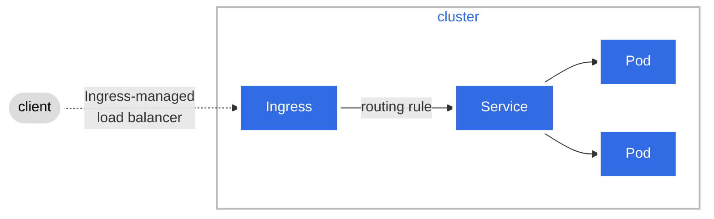
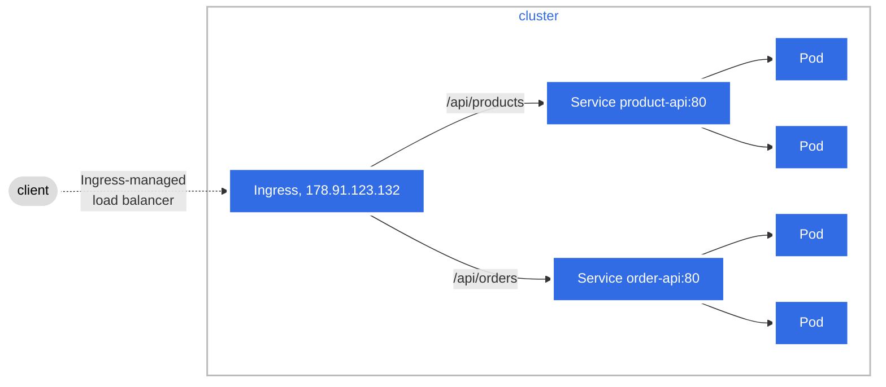
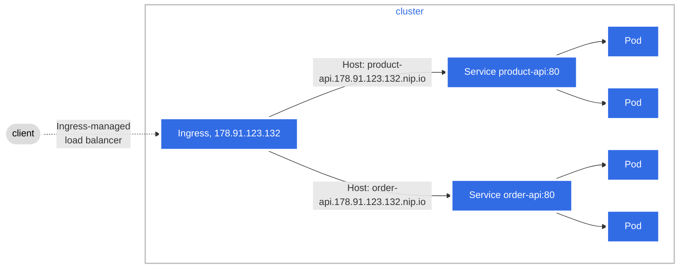
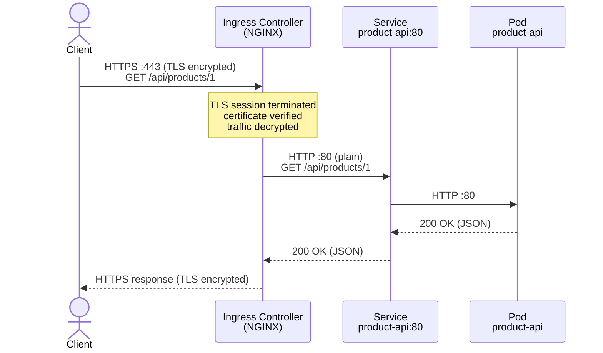
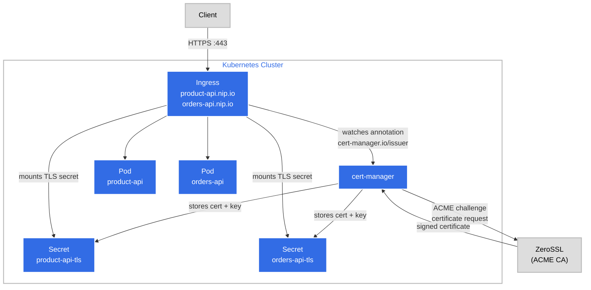

# Azure AKS bootstrap: Security and Ingress

Objectives
- Configure name-based virtual hosting using Helm and nip.io.
- Add TLS termination to the Ingress using a certificate provisioned automatically by cert-manager and ZeroSSL.

## Ingresses and Ingress controller

### Ingress

An **Ingress** is a Kubernetes resource that manages external access to services within a cluster, typically HTTP/HTTPS. 

It provides routing rules to direct traffic to the appropriate services based on the request's host and path.



### Ingress rules

Each http rule contains the following information:

- An optional **host**. In this example, no host is specified (see `springbootapp-ingress.yaml`), so the rule applies to all inbound HTTP traffic through the IP address specified. If a host is provided (for example, `foo.bar.com`), the rules apply to that host.
- A list of **paths** (for example, `/api/products`), each of which has an associated backend defined with a `service.name` and a `service.port.name` or `service.port.number`. Both the host and path must match the content of an incoming request before the load balancer directs traffic to the referenced Service.
- A backend is a combination of Service and port names as described in the Service doc or a custom resource backend by way of a CRD. 

HTTP (and HTTPS) requests to the Ingress that match the host and path of the rule are sent to the listed backend. In this example, requests to `/api/products` are forwarded to the `product-api` service on port `80`.

```yaml
# springbootapp-ingress.yaml
spec:
  ingressClassName: webapprouting.kubernetes.azure.com
  rules:
    - http:
        paths:
          - path: /api/products
            pathType: Prefix
            backend:
              service:
                name: product-api
                port:
                  number: 80
```


### Ingress controller

An ingress controller:
- Is responsible for fulfilling the Ingress;
- Can route HTTP traffic to different applications based on the inbound URL;
- Operates at layer 7 (application layer HTTP/HTTPS) as apposed to a load balancer which operates at layer 4 (transport layer TCP/UDP);
- Provides features like SSL termination, path-based routing, and load balancing

The following table lists the different ingress controllers available in Azure AKS and the recommended ingress controller for each scenario:

| Ingress option | When to use |
|---|---|
| **Managed NGINX - Application Routing add-on** | • In-cluster NGINX ingress controller <br> • Basic load balancing and routing <br> • Internal/external LB and static IP config <br> • Azure Key Vault cert integration <br> • Azure DNS Zones integration <br> • Supports the Ingress API |
| **Application Gateway for Containers** | • Azure-hosted ingress gateway <br> • Advanced traffic management (retries, AZ resiliency, mTLS, traffic splitting, autoscaling) <br> • Azure Key Vault and DNS Zones integration <br> • Supports Ingress and Gateway APIs |
| **Istio Ingress Gateway** | • Envoy-based, for use with Istio service mesh <br> • Advanced traffic management (rate limiting, circuit breaking) <br> • mTLS support |

In this project, **Web Application Routing** is used (`webapprouting.kubernetes.azure.com`), as it is the recommended managed option for AKS with built-in NGINX, DNS, and TLS integration.


### Ingress class

Ingress classes are used to specify which ingress controller should implement a given ingress.

In this project, the ingress class used is `webapprouting.kubernetes.azure.com` (see `springbootapp-ingress.yaml`), which corresponds to the **Web Application Routing** add-on in Azure AKS. This add-on is powered by NGINX and provides layer 7 load balancing, path-based routing, and SSL termination without requiring a separate Application Gateway.

Azure AKS also supports the **Application Gateway Ingress Controller (AGIC)**, which integrates with Azure Application Gateway and provides additional features like a Web Application Firewall (WAF). The two controllers use different ingress class names (`webapprouting.kubernetes.azure.com` vs `azure/application-gateway`).


### Types of Ingress

Simple fanout — no host specified, routing by path (see `springbootapp-ingress.yaml`):



Name-based virtual hosting — routing by host header (see `my-chart/templates/ingress.yaml`):



### Name-based virtual hosting (own domain)

To use an existing domain name (e.g. `mydomain.com`) with the Web Application Routing: add-on, follow these steps:
(1) create an **Azure DNS Zone** for it (`az network dns zone create`), 
(2) delegate the zone nameservers to Azure at your registrar, 
(3) link the zone to the Web Application Routing add-on (`az aks approuting zone add --attach-zones`), and 
(4) add the `host:` field to the Ingress manifest. The add-on will then automatically create a DNS `A` record pointing to the ingress IP.

---

### Name-based virtual hosting with Helm (nip.io — no domain required)

If a domain is not available, another option is to use [nip.io](https://nip.io) — a wildcard DNS service that resolves any hostname of the form `<name>.<ip>.nip.io` directly to `<ip>`, with no DNS zone or registrar needed.

Use **Helm** to inject the value at deploy time.

The chart is structured as follows:

```
my-chart/
  Chart.yaml
  values.yaml
  templates/
    ingress.yaml
```

#### Step 1: Get the Ingress external IP

Get the external IP assigned to the Web Application Routing add-on:

```powershell
$INGRESS_IP=$(kubectl get svc -n app-routing-system nginx -o jsonpath='{.status.loadBalancer.ingress[0].ip}')
Write-Host $INGRESS_IP
```

#### Step 2: Review the Helm chart files

`my-chart/templates/ingress.yaml` — the host is injected by Helm at deploy time:

```yaml
spec:
  ingressClassName: webapprouting.kubernetes.azure.com
  rules:
    - host: {{ .Values.ingress.host }}   # ← Helm injects this value
      http:
        paths:
          - path: /api/products
            pathType: Prefix
            backend:
              service:
                name: product-api
                port:
                  number: 80
```

`my-chart/values.yaml` — default value (replace with your actual IP or override at install time):

```yaml
ingress:
  host: product-api.198.51.100.1.nip.io
```

#### Step 3: Deploy with Helm

Pass the actual ingress IP at deploy time using `--set`. 
Helm builds the hostname dynamically.

If you already have an existing Ingress deployed with `kubectl apply`, delete it first to avoid conflicts with Helm ownership:

```powershell
kubectl delete ingress product-api -n app
```

Then deploy with Helm:

```powershell

helm upgrade --install my-app ./my-chart --set ingress.host="product-api.$INGRESS_IP.nip.io"
```

Verify the Ingress was created with the correct hostname:

```powershell
kubectl get ingress -n app
```

Test the API — no DNS zone or registrar needed, `nip.io` resolves the hostname automatically:

```powershell
# GET product by ID
Invoke-RestMethod -Uri "http://product-api.$INGRESS_IP.nip.io/api/products/1" -Method Get
```

---

### Gateway API

Ingress is designed to be a simple way to expose HTTP and HTTPS routes from outside the cluster to services within the cluster. 
It has limitations in terms of flexibility and features like 
- support for non-HTTP protocols
- header-based routing
- advanced traffic management capabilities (traffic weighting, mirroring, retries, etc.).

Ingress controllers relay on custom resource definitions (CRDs) to extend Kubernetes API and provide additional features.
(NGINX Ingress Controller or Envoy Ingress Controller)

Kubernetes Gateway API is a flexible and extensible Ingress successor that addresses the limitations of traditional Ingress. 

## Security 

### TLS termination

TLS termination is the process of decrypting incoming encrypted traffic (HTTPS) 
before it reaches the backend services.

An intermediary, such as a load balancer (e.g., AWS Network Load Balancer, NGINX), 
receives encrypted traffic from the client,
terminates the TLS session, and passes decrypted data to internal servers.




TLS termination can be configured at the Ingress level, 
allowing the Ingress controller to handle SSL/TLS encryption and decryption. 
This is typically done by specifying a TLS secret that contains the certificate 
and private key. The TLS secret must contain keys named tls.crt and tls.key 
that contain the certificate and private key to use for TLS.

```yaml
apiVersion: v1
kind: Secret
metadata:
  name: product-api-tls
  namespace: app
data:
  tls.crt: base64 encoded cert
  tls.key: base64 encoded key
type: kubernetes.io/tls
```

The certificates would have to be issued for all the possible sub-domains. 
Therefore, hosts in the tls section need to explicitly 
match the host in the rules section.

```yaml
apiVersion: networking.k8s.io/v1
kind: Ingress
metadata:
  name: product-api
  namespace: app
spec:
  tls:
  - hosts:
      - product-api.178.91.123.132.nip.io   # ← must match the host in rules
    secretName: product-api-tls
  ingressClassName: webapprouting.kubernetes.azure.com
  rules:
  - host: product-api.178.91.123.132.nip.io
    http:
      paths:
      - path: /api/products
        pathType: Prefix
        backend:
          service:
            name: product-api
            port:
              number: 80
```


### cert-manager

[cert-manager](https://cert-manager.io/docs/installation/) automates the provisioning, renewal, and management of TLS certificates in Kubernetes. Instead of manually creating a `kubernetes.io/tls` secret, cert-manager watches Ingress resources annotated with a certificate issuer and requests certificates from a CA (e.g. Let's Encrypt) automatically.



The **ACME** (Automated Certificate Management Environment) protocol automates the issuance, validation, and renewal of SSL/TLS certificates. cert-manager implements ACME to communicate with CAs such as ZeroSSL or Let's Encrypt — it handles the challenge-response flow, stores the resulting certificate as a Kubernetes Secret, and renews it automatically before expiry.

#### Step 4: Install cert-manager

Install cert-manager using the official static manifest (see [4]):

```powershell
kubectl apply -f https://github.com/cert-manager/cert-manager/releases/download/v1.17.2/cert-manager.yaml
```

Verify all cert-manager pods are running:

```powershell
kubectl get pods -n cert-manager
```

#### Step 5: Create a ClusterIssuer

A `ClusterIssuer` is a cluster-scoped resource that tells cert-manager which Certificate Authority (CA) to use and how to prove domain ownership (e.g. via HTTP-01 ACME challenge).

For **production** with a real domain, the recommended free ACME CAs are:

| CA | ACME server | Notes |
|---|---|---|
| **Let's Encrypt** | `https://acme-v02.api.letsencrypt.org/directory` | Most widely used, no EAB required |
| **Buypass Go SSL** | `https://api.buypass.com/acme/directory` | Free, no EAB, 180-day validity |
| **ZeroSSL** | `https://acme.zerossl.com/v2/DV90` | Free, requires EAB credentials from ZeroSSL dashboard |

This example uses **ZeroSSL**, which issues certificates for a wider range of hostnames including `nip.io`. ZeroSSL requires **External Account Binding (EAB)** — a mechanism that links your ACME account to your ZeroSSL account using credentials from the ZeroSSL dashboard.
For production with a real domain, Let's Encrypt or Buypass are simpler choices as they require no EAB setup.


##### Step 5a: Obtain EAB credentials from ZeroSSL

1. Sign up or log in at [app.zerossl.com](https://app.zerossl.com)
2. Go to **Developer** → **EAB Credentials** → **Generate**
3. Copy the **EAB KID** and **EAB HMAC Key**

Store the HMAC key as a Kubernetes secret so cert-manager can reference it securely:

```powershell
kubectl create secret generic zerossl-eab-secret `
  --from-literal=secret=<your-eab-hmac-key> `
  --namespace cert-manager
```

##### Step 5b: Create the ClusterIssuer

```yaml
apiVersion: cert-manager.io/v1
kind: ClusterIssuer
metadata:
  name: zerossl
spec:
  acme:
    server: https://acme.zerossl.com/v2/DV90
    email: your-email@example.com
    externalAccountBinding:
      keyID: <your-eab-kid>             # ← EAB KID from ZeroSSL dashboard
      keySecretRef:
        name: zerossl-eab-secret        # ← Secret created in Step 5a
        key: secret
    privateKeySecretRef:
      name: zerossl-account-key
    solvers:
      - http01:
          ingress:
            ingressClassName: webapprouting.kubernetes.azure.com
```

```powershell
kubectl apply -f cert-manager/cluster-issuer.yaml
kubectl get clusterissuer
kubectl describe clusterissuer zerossl   # verify Ready: True
```

#### Step 6: Annotate the Ingress

Include the cluster issuer annotation in `my-chart/templates/ingress.yaml` and the `tls` block. 
cert-manager will detect the annotation and automatically create the `product-api-tls` Secret:

```yaml
apiVersion: networking.k8s.io/v1
kind: Ingress
metadata:
  name: product-api
  namespace: app
  annotations:
    cert-manager.io/cluster-issuer: zerossl        # ← cert-manager watches this
spec:
  ingressClassName: webapprouting.kubernetes.azure.com
  tls:
    - hosts:
        - {{ .Values.ingress.host }}
      secretName: product-api-tls                  # ← cert-manager creates this Secret
  rules:
    - host: {{ .Values.ingress.host }}             # ← Helm injects the nip.io hostname
      http:
        paths:
          - path: /api/products
            pathType: Prefix
            backend:
              service:
                name: product-api
                port:
                  number: 80
```

Deploy with Helm — cert-manager will provision the certificate automatically after the Ingress is created:

```powershell
helm upgrade --install my-app ./my-chart --set ingress.host="product-api.$INGRESS_IP.nip.io"
```

#### Step 7: Verify the certificate

```powershell
kubectl get certificate -n app
kubectl describe certificate product-api-tls -n app
```

Wait until the certificate shows `Ready: True` before proceeding.

#### Step 8: Send requests over HTTPS

Once the certificate is provisioned, the API is reachable over HTTPS:

```powershell
# GET product by ID
Invoke-RestMethod -Uri "https://product-api.$INGRESS_IP.nip.io/api/products/1" -Method Get

# POST a new product
$body = @{
  name        = "Laptop"
  description = "High-performance laptop"
  price       = 1299.99
  quantity    = 50
} | ConvertTo-Json

Invoke-RestMethod -Uri "https://product-api.$INGRESS_IP.nip.io/api/products" `
  -Method Post `
  -ContentType "application/json" `
  -Body $body
```

Confirm TLS is working by inspecting the certificate details:

```powershell
Invoke-WebRequest -Uri "https://product-api.$INGRESS_IP.nip.io/api/products/1" -Method Get | Select-Object -ExpandProperty Headers
```

---

## References

[1] [K8s ingress](https://kubernetes.io/docs/concepts/services-networking/ingress/)

[2] [Ingress in AKS](https://learn.microsoft.com/en-us/azure/aks/concepts-network-ingress)

[3] [Cert Manager](https://github.com/cert-manager/cert-manager)

[4] [Cert Manager Installation](https://cert-manager.io/docs/installation/)

### Development Notes

Architecture documentation, dns-diagrams developed with assistance from Claude AI (Anthropic).

```text
Anthropic. (2026). Claude [claude-sonnet-4-5-20250929].
https://claude.ai
```

Kubernetes manifests also developed
with assistance from GitHub Copilot (Microsoft).

```text
Microsoft. (2026). GitHub Copilot [GPT-4o].
https://github.com/features/copilot
```

