# Azure AKS bootstrap

Objectives
- Deploy the Kubernetes demo repository to a basic Azure Kubernetes Service (AKS) cluster.

## K8 architecture overview

Control plane components:
- etcd: A distributed key-value store that Kubernetes uses to store all cluster data.
- kube-apiserver: The API server that serves the Kubernetes API and acts as the frontend for the Kubernetes control plane.
- kube-scheduler: The component responsible for scheduling Pods onto Nodes based on resource availability and other constraints.
- kube-controller-manager: A component that runs various controllers to manage the state of the cluster, such as node lifecycle, replication, and endpoint management.
- cloud-controller-manager: A component that integrates with cloud providers to manage cloud-specific resources, such as load balancers, storage, and networking.

Node components:
- kubelet: An agent that runs on each Node and ensures that containers are running in a Pod.
- kube-proxy: A network proxy that runs on each Node and maintains network rules to allow communication between Pods and Services.
- Container runtime: The software responsible for running containers, such as Docker.

Addon components:
- CoreDNS: A DNS server that provides name resolution for services and Pods within the cluster.

Kubernetes creates DNS records for Services and Pods. You can contact Services with consistent DNS names instead of IP addresses.

**ClusterIP** — internal-only virtual IP; DNS resolves to the ClusterIP and kube-proxy routes traffic to the backing Pods.



**Headless** — no ClusterIP is allocated; DNS resolves directly to individual Pod IPs, giving clients full control over load balancing.



**LoadBalancer** — builds on ClusterIP and provisions a cloud load balancer with a public IP so external traffic can reach the Service.




## Prerequisites

- Azure CLI installed (`az`)
Windows (PowerShell):
```powershell
winget install --exact --id Microsoft.AzureCLI
```

Ubuntu:
```bash
curl -sL https://aka.ms/InstallAzureCLIDeb | sudo bash
```

```bash
az version
```

- `kubectl` installed
- Access to an Azure subscription
- Azure CLI version that supports `--node-provisioning-mode` and `--node-provisioning-default-pools` for AKS

### Step 1: Select subscription

Log in with `az login` and select your subscription.

```powershell
$SUBSCRIPTION_ID="your-subscription-id-or-name"
az account set --subscription $SUBSCRIPTION_ID
```

Register the `Microsoft.ContainerService` resource provider before creating any AKS resources.
On student and new Azure subscriptions this provider is not registered by default — without it, all `az aks` commands fail with a `MissingSubscriptionRegistration` error.
Registration is a one-time operation per subscription.

```powershell
az provider register --namespace Microsoft.ContainerService
 
# Wait for registration to complete (takes ~1 minute)
az provider show --namespace Microsoft.ContainerService --query "registrationState"
# Expected output: "Registered"
```

### Step 2: Create a resource group

Set the resource group name, location, and cluster name.

```powershell
# Variables
$RESOURCE_GROUP="azurek8-rg"
$LOCATION="polandcentral"
$CLUSTER_NAME="azurek8-cluster"


# Create the resource group
az group create `
  --name $RESOURCE_GROUP `
  --location $LOCATION
```

### Step 3: Create an AKS cluster

Create:
- a basic AKS cluster named `azurek8-cluster`
- `Standard_D2s_v3` VM size (2 vCPU, 8 GB RAM) which is commonly available in free-tier subscriptions

> For demo purposes, use AKS node auto-provisioning instead of a fixed `--node-count` value. - AKS node auto-provisioning with the default [Karpenter-backed](https://karpenter.sh/) node pools

```powershell
# Create a basic AKS cluster with node auto-provisioning enabled
az aks create `
--resource-group $RESOURCE_GROUP `
--name $CLUSTER_NAME `
--location $LOCATION `
--node-count 2 `
--node-vm-size Standard_D2s_v3 `
--tier free `
--generate-ssh-keys
```

### Step 4: Switch to the AKS context

Download kubeconfig credentials for `kubectl`.

```powershell
az aks get-credentials `
  --resource-group $RESOURCE_GROUP `
  --name $CLUSTER_NAME `
  --overwrite-existing
```

Switch to the AKS context:

```powershell
kubectl config use-context $CLUSTER_NAME

# Verify the cluster is available
kubectl get nodes
kubectl get pods -A
```

### Step 5: Optional checks

Confirm the Azure resources were created successfully:

```powershell
az group show --name azurek8-rg --output table
az aks show --resource-group azurek8-rg --name azurek8-cluster --output table
az aks nodepool list --resource-group azurek8-rg --cluster-name azurek8-cluster --output table
```

### Step 6: Apply the manifests from the product-api demo

Apply manifests in the same order used in product-api demo.

```powershell
# Shared secrets (MySQL + Redis/Envoy connection settings)
kubectl apply -f namespaces.yaml
kubectl apply -f secrets.yaml

# MySQL
kubectl apply -f mysql/mysql-statefulset.yaml
kubectl apply -f mysql/mysql-service.yaml

# Redis + headless service
kubectl apply -f redis/redis-statefulset.yaml
kubectl apply -f redis/redis-service.yaml

# Envoy config + deployment + service
kubectl apply -f redis/envoy-configmap.yaml
kubectl apply -f redis/envoy-deployment.yaml
kubectl apply -f redis/envoy-service.yaml

# Spring Boot API deployment + service
kubectl apply -f springbootapp/springbootapp-deployment.yaml
kubectl apply -f springbootapp/springbootapp-service-loadbalancer.yaml
```

Check rollout and resource health:

```powershell
kubectl rollout status statefulset/mysql -n data
kubectl rollout status statefulset/sharded-redis -n data
kubectl rollout status deployment/envoy -n data
kubectl rollout status deployment/product-api -n app

kubectl get pods -n data
kubectl get pods -n app
kubectl get svc -n data
kubectl get svc -n app
kubectl get endpoints redis -n data
```

Get the public endpoint for `product-api` (AKS LoadBalancer):

```powershell
kubectl get svc product-api -w -n app
```

When `EXTERNAL-IP` is assigned, test the API:

```powershell
$APP_IP="<external-ip>"

# POST a new product
$body = @{
  name        = "Laptop"
  description = "High-performance laptop"
  price       = 1299.99
  quantity    = 50
} | ConvertTo-Json

Invoke-RestMethod -Uri "http://$APP_IP/api/products" `
  -Method Post `
  -ContentType "application/json" `
  -Body $body

# GET product by ID
Invoke-RestMethod -Uri "http://$APP_IP/api/products/1" -Method Get
```

If you update the image or configuration later:

```powershell
kubectl rollout restart deployment/product-api -n app
kubectl rollout status deployment/product-api -n app
```

#### Optional monitoring steps (Prometheus + Grafana)

Install Helm repos and deploy charts used by this repo:

```powershell
helm repo add prometheus-community https://prometheus-community.github.io/helm-charts
helm repo add grafana https://grafana.github.io/helm-charts
helm repo update

helm upgrade --install prometheus prometheus-community/prometheus
helm upgrade --install grafana grafana/grafana -f prometheus-grafana/grafana-values.yaml
```

Enable Redis exporter sidecar and Prometheus scrape config:

```powershell
kubectl apply -f redis/redis-statefulset-exporter.yaml
kubectl rollout status statefulset/sharded-redis -n data

kubectl apply -f prometheus-grafana/prometheus-server-cm-redis.yaml
kubectl rollout restart deployment/prometheus-server 
kubectl rollout status deployment/prometheus-server
```

Useful checks:

```powershell
helm list
kubectl get pods
kubectl get svc
kubectl get configmap prometheus-server -o yaml | findstr "job_name"
```

Before cleanup, expose Prometheus and Grafana with `LoadBalancer` Services in AKS:

```powershell
# optional for student subscription, test LoadBalancer type for Grafana only to save resources (comment out if you want to expose both)
# kubectl patch svc prometheus-server -p '{\"spec\":{\"type\":\"LoadBalancer\"}}'
# optional kubectl port-forward svc/prometheus-server 9090:80
kubectl patch svc grafana -p '{\"spec\":{\"type\":\"LoadBalancer\"}}'

kubectl get svc prometheus-server -w
kubectl get svc grafana -w
```

Optional direct checks after external IPs are assigned:

```powershell
kubectl get svc prometheus-server
kubectl get svc grafana
```


Get the admin password:

```bash
kubectl get secret grafana -o jsonpath="{.data.admin-password}" | %{[System.Text.Encoding]::UTF8.GetString([System.Convert]::FromBase64String($_))}
```
Use the `EXTERNAL-IP` of the `grafana` Service to open Grafana in your browser (`http://<grafana-external-ip>`

Inspect logs with:

```powershell
kubectl logs deploy/product-api -n app
kubectl logs deploy/envoy -n data
kubectl get pods -l app=redis -n data
kubectl get pods -l app=mysql -n data
```

### Step 7: Verify service types on the cluster

Inspect the three service types shown in the architecture diagrams above.

**ClusterIP** — internal virtual IP, used by Envoy:

```powershell
kubectl get svc envoy -n data
kubectl describe svc envoy -n data
```

Expected: `Type: ClusterIP`, a stable `CLUSTER-IP` assigned, no `EXTERNAL-IP`. Verify DNS resolves to the single ClusterIP:

```powershell
kubectl run dns-test --image=busybox:1.28 --restart=Never -it --rm -n data `
  -- nslookup envoy.data.svc.cluster.local
```

Expected: a single A record pointing to the ClusterIP address.

To demonstrate that the ClusterIP stays stable even after the Pod is rescheduled, note the IP before, delete the Pod, then resolve again:

```powershell
# 1 — record the current ClusterIP
kubectl run dns-test --image=busybox:1.28 --restart=Never -it --rm -n data `
  -- nslookup envoy.data.svc.cluster.local

# 2 — delete the Envoy Pod (Deployment will reschedule it with a new Pod IP)
kubectl delete pod -l app=envoy -n data

# 3 — wait for the new Pod to be ready
kubectl rollout status deployment/envoy -n data

# 4 — resolve again: ClusterIP is unchanged
kubectl run dns-test --image=busybox:1.28 --restart=Never -it --rm -n data `
  -- nslookup envoy.data.svc.cluster.local
```

Expected: the A record returns the **same ClusterIP** both times, even though the underlying Pod IP has changed.

**Headless** — no ClusterIP, DNS resolves directly to Pod IPs, used by Redis shards:

```powershell
kubectl get svc redis -n data
kubectl describe svc redis -n data
```

Expected: `Type: ClusterIP`, `CLUSTER-IP: None`. Verify DNS resolves to individual Pod IPs:

```powershell
kubectl run dns-test --image=busybox:1.28 --restart=Never -it --rm -n data `
  -- nslookup redis.data.svc.cluster.local
```

Each Redis Pod (`sharded-redis-0`, `sharded-redis-1`, `sharded-redis-2`) should appear as a separate A record.

To demonstrate that Pod IPs **do change** after a Pod is rescheduled (contrast with ClusterIP above):

```powershell
# 1 — record the current Pod IPs
kubectl run dns-test --image=busybox:1.28 --restart=Never -it --rm -n data `
  -- nslookup redis.data.svc.cluster.local

# 2 — delete one Redis Pod (StatefulSet will reschedule it)
kubectl delete pod sharded-redis-0 -n data

# 3 — wait for the Pod to be ready again
kubectl rollout status statefulset/sharded-redis -n data

# 4 — resolve again: the A record for sharded-redis-0 now points to a new IP
kubectl run dns-test --image=busybox:1.28 --restart=Never -it --rm -n data `
  -- nslookup redis.data.svc.cluster.local
```

Expected: the A record for `sharded-redis-0` returns a **different IP** after rescheduling, while the other shards are unchanged.

**LoadBalancer** — public IP, used by the Spring Boot API:

```powershell
kubectl get svc product-api -n app
kubectl describe svc product-api -n app
```

Expected: `Type: LoadBalancer`, a public `EXTERNAL-IP` assigned by Azure.

**MySQL StatefulSet rollout** — confirm the StatefulSet is fully rolled out before testing DNS:

```powershell
kubectl rollout status statefulset/mysql -n data
```

Verify DNS resolves to the MySQL Pod IP via the headless governing service:

```powershell
kubectl run dns-test --image=busybox:1.28 --restart=Never -it --rm -n data `
  -- nslookup mysql.data.svc.cluster.local
```

Expected: a single A record pointing directly to the `mysql-0` Pod IP.

## Ingress in AKS

An ingress controller provides a single public IP entry point and routes HTTP/HTTPS traffic to internal ClusterIP services by path or hostname — replacing the need for a `LoadBalancer` service per application. It operates at Layer 7 (HTTP), unlike a `LoadBalancer` service which operates at Layer 4 (TCP) and has no awareness of URL paths or hostnames.

```
Client → Azure Load Balancer (L4) → Ingress Controller (L7) → ClusterIP Service → Pod
```

### Ingress options on AKS

Microsoft provides three managed ingress solutions. The OSS `ingress-nginx` controller installed via Helm was retired in March 2026 and it requires manual NSG rule management to allow external traffic through.

| Option | API | Hosting | Best for |
|---|---|---|---|
| **Application Routing add-on** (managed NGINX) | Ingress API | In-cluster | General purpose; Azure DNS + Key Vault integration |
| **Application Gateway for Containers** | Ingress + Gateway API | Azure hosted | mTLS, traffic splitting, zone resiliency |
| **Istio Ingress Gateway** | Istio API | In-cluster | Service mesh deployments |

The **Application Routing add-on** is the recommended starting point: it is fully managed by AKS (automatic NSG rules, controller lifecycle, public IP provisioning), integrates with Azure Key Vault for TLS certificates, and is supported by Microsoft through November 2026.

AKS is aligning with the upstream Kubernetes community by moving to [Gateway API](https://gateway-api.sigs.k8s.io) as the long-term standard for L7 traffic management, superseding the `Ingress` resource. The Application Routing add-on will evolve toward Gateway API support. For new clusters, plan for this migration path:

```
Ingress API (now)  →  Gateway API / HTTPRoute (future)
```

### Step 8: Ingress

Enable the AKS Application Routing add-on and switch the `product-api` service from `LoadBalancer` to `ClusterIP`. External traffic now flows through the managed ingress controller only.

```powershell
# Switch product-api to ClusterIP (delete first to avoid type-change conflict)
kubectl delete svc product-api -n app
kubectl apply -f springbootapp/springbootapp-service-clusterip.yaml
 
# Enable the managed Application Routing add-on
az aks approuting enable `
  --resource-group azurek8-rg `
  --name azurek8-cluster
```

Apply the ingress manifest. The add-on registers the `webapprouting.kubernetes.azure.com` ingress class automatically:

```powershell
kubectl apply -f springbootapp/springbootapp-ingress.yaml
```

Verify the ingress resource and wait for an address to be assigned:

```powershell
# Watch for the ADDRESS column to populate
kubectl get ingress -n app -w
 
kubectl describe ingress product-api -n app
```

Expected: `ADDRESS` is the public IP provisioned by the add-on, `CLASS` is `webapprouting.kubernetes.azure.com`.

Test the API through the ingress:

```powershell
# Get the IP from the add-on's nginx service (lives in app-routing-system namespace)
$INGRESS_IP = kubectl get service -n app-routing-system nginx `
  -o jsonpath="{.status.loadBalancer.ingress[0].ip}"

Write-Host "Ingress IP: $INGRESS_IP"

# POST a new product
$body = @{
  name        = "Laptop"
  description = "High-performance laptop"
  price       = 1299.99
  quantity    = 50
} | ConvertTo-Json

Invoke-RestMethod -Uri "http://$INGRESS_IP/api/products" `
  -Method Post `
  -ContentType "application/json" `
  -Body $body

# GET product by ID
Invoke-RestMethod -Uri "http://$INGRESS_IP/api/products/1" -Method Get
```

### Step 9: Grafana Ingress

Rather than patching Grafana to a `LoadBalancer` service (which allocates an extra public IP), route external traffic through the same Application Routing ingress controller used by `product-api`.

Grafana is deployed by Helm into the `default` namespace. The ingress resource must live in the same namespace as the service it targets, so this ingress goes into `default` rather than `app`.

Because Grafana's UI uses relative paths internally, routing it under a sub-path (e.g. `/grafana`) requires rewriting the root URL inside Grafana itself. The simplest approach for a demo is to use a dedicated ingress resource at the root path, which requires no Grafana configuration changes.

Apply `prometheus-grafana/grafana-ingress.yaml`:

```powershell
kubectl patch svc grafana -p '{\"spec\":{\"type\":\"ClusterIP\"}}'

kubectl apply -f prometheus-grafana/grafana-ingress.yaml
```

The Application Routing add-on provisions a **separate public IP** per ingress class instance when ingresses exist in multiple namespaces. Verify both ingresses and their addresses:

```powershell
kubectl get ingress -n app
kubectl get ingress -n default
```

Get the Grafana ingress IP:

```powershell
# The add-on may assign the same or a different IP depending on controller sharing
kubectl get ingress grafana -n default -o jsonpath="{.status.loadBalancer.ingress[0].ip}"
```

Get the admin password and open the dashboard:

```powershell
kubectl get secret grafana -o jsonpath="{.data.admin-password}" `
  | %{[System.Text.Encoding]::UTF8.GetString([System.Convert]::FromBase64String($_))}
```

Open `http://<grafana-ingress-ip>` in a browser and log in with `admin` / `<password>`.

### Step 10: Cleanup (delete the Azure resource group)

Delete the entire resource group to remove the AKS cluster and all related Azure resources.

```powershell
$RESOURCE_GROUP="azurek8-rg"

az group delete `
  --name $RESOURCE_GROUP `
  --yes `
```

Optional check:

```powershell
az group exists --name azurek8-rg
```

### Development Notes

Architecture documentation, dns-diagrams developed with assistance from Claude AI (Anthropic).

```text
Anthropic. (2026). Claude [claude-sonnet-4-5-20250929].
https://claude.ai
```

Kubernetes manifests also developed
with assistance from GitHub Copilot (Microsoft).

```text
Microsoft. (2026). GitHub Copilot [GPT-4o].
https://github.com/features/copilot
```
