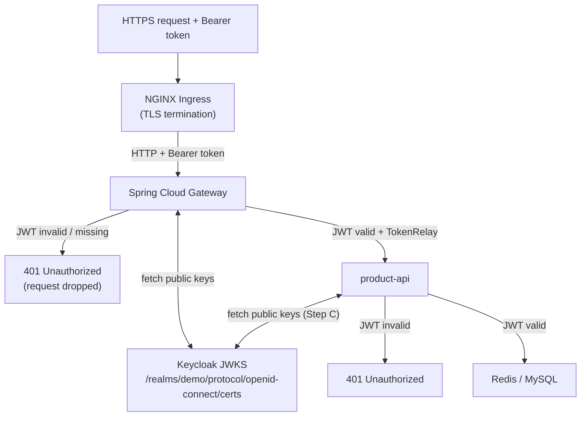

# Azure AKS Bootstrap: API Gateway Authentication with Keycloak

## Objectives

This project demonstrates the deployment of a secured microservice architecture on Azure Kubernetes Service (AKS). Specifically, it aims to:

- Provision an AKS cluster and deploy a stateful product API backed by MySQL and Redis, exposed securely via HTTPS using a managed NGINX ingress controller and automated TLS certificate issuance through ZeroSSL and cert-manager.
- Introduce a **Spring Cloud Gateway** as the single entry point for all external traffic, enforcing OAuth 2.0 Bearer token validation prior to proxying requests downstream.
- Integrate **Keycloak** as the identity provider, issuing JWT access tokens via the client-credentials grant, and configure both the gateway and the product API as OAuth 2.0 resource servers (defence-in-depth).
- Demonstrate infrastructure-as-code principles: all configuration is expressed declaratively through Kubernetes manifests, Helm charts, and a reproducible PowerShell deployment script.

---

## Project Setup

The current architecture is provisioned end-to-end by running:

```powershell
.\deploy.ps1
```

The script performs the following in order:

1. Creates an Azure resource group and an AKS cluster (`Standard_D2s_v3`, 2 nodes, free tier).
2. Applies namespace and secret manifests to establish isolation between the `data` and `app` namespaces.
3. Deploys the stateful data layer: a **MySQL** StatefulSet (product database) and a **Redis** StatefulSet (cache), fronted by an **Envoy** sidecar proxy that exposes Redis on a stable internal address.
4. Deploys the **product-api** Spring Boot application and its ClusterIP service.
5. Installs **Prometheus** and **Grafana** via Helm for observability, including a Redis metrics exporter and a custom Prometheus scrape configuration.
6. Enables the AKS **Application Routing** add-on (managed NGINX ingress controller) and installs **cert-manager** for automated TLS provisioning via ZeroSSL.
7. Deploys the **Helm chart** (`my-chart`), which renders a single Ingress resource routing `product-api.<IP>.nip.io` to the product API and `grafana.<IP>.nip.io` to Grafana, both secured with TLS certificates issued by the ZeroSSL `ClusterIssuer`.

### Testing the secured product API

  ```powershell
# Get the external IP address of the Application Routing ingress controller
$INGRESS_IP=$(kubectl get svc -n app-routing-system nginx -o jsonpath='{.status.loadBalancer.ingress[0].ip}')
Write-Host $INGRESS_IP


# POST a new product
$body = @{
  name        = "Laptop"
  description = "High-performance laptop"
  price       = 1299.99
  quantity    = 50
} | ConvertTo-Json

Invoke-RestMethod -Uri "https://product-api.$INGRESS_IP.nip.io/api/products" `
  -Method Post `
  -ContentType "application/json" `
  -Body $body
  
# GET product by ID
Invoke-RestMethod -Uri "https://product-api.$INGRESS_IP.nip.io/api/products/1" -Method Get  
```

---

## Spring Cloud Gateway

### Role in the Architecture

Spring Cloud Gateway acts as a reactive **edge server**: the sole component reachable from outside the cluster. All inbound requests pass through it before reaching any backend service. This separation provides a clean boundary between public-facing concerns and internal service logic.

Spring Cloud Gateway sits between the Ingress
controller and `product-api`. It has two responsibilities:

1. **JWT validation** — every incoming request must carry a valid Bearer token.
   Spring Security's `ReactiveJwtDecoder` fetches Keycloak's public keys from
   the JWKS endpoint once on startup and verifies token signatures locally on
   each request. No network call to Keycloak per request (stateless).
   Requests without a token, or with an invalid/expired token, are rejected
   with `401 Unauthorized` before reaching any route.

2. **Token relay** — after validation, the `TokenRelay` filter copies the
   Bearer token into the `Authorization` header of the forwarded request.
   `product-api` receives the same token and performs its own independent
   validation (defence-in-depth, configured in Step C).




### Advantages of an Edge Server / API Gateway

- **Single entry point.** External clients interact with one address only; the gateway resolves and forwards requests to the appropriate microservice internally. Clients are decoupled from service topology changes.
- **Centralised cross-cutting concerns.** Authentication, authorisation, rate limiting, distributed tracing, and structured logging are implemented once at the gateway rather than duplicated across every service (*DRY principle*).
- **Resilience boundary.** The gateway can enforce timeouts, retries, and circuit-breaking patterns, preventing failures in one downstream service from cascading to clients.
- **Dynamic routing.** Routing rules can be based on path prefixes, headers, query parameters, or API version, enabling blue/green deployments and canary releases without client-side changes.

### Spring Cloud Gateway Specifics

- Built on the **Spring WebFlux** reactive framework; handles concurrent connections efficiently without blocking threads.
- Implements a **filter chain** (pre-filters and post-filters) that can inspect and mutate requests and responses at each stage of the pipeline.
- Spring Security's OAuth2 resource server support validates the incoming Bearer JWT against Keycloak's JWKS endpoint before forwarding the request; invalid or absent tokens are rejected at the edge with 401 Unauthorized. The TokenRelay filter is then responsible for propagating the validated token downstream to product-api.
- Routes are declared entirely in `application.yaml` — no Java routing code is required.


## Keycloak

Keycloak is an open-source Identity and Access Management (IAM) solution that provides centralised authentication, authorisation, and user management for modern distributed applications. It implements industry-standard protocols (OAuth 2.0, OpenID Connect, SAML 2.0), eliminating the need to implement security logic in individual services.

### Core Concepts

| Concept | Description |
|---|---|
| **Realm** | An isolated administrative domain that groups users, credentials, roles, and clients. Analogous to a tenant; in this project the realm is named `demo`. |
| **Client** | A registered application or service that delegates authentication to Keycloak. In this project, `gateway-client` uses the **client-credentials** grant (machine-to-machine, no user interaction required). |
| **User** | A person or system principal managed within a realm. Test users are assigned roles that downstream services enforce via token claims. |
| **Role** | A named permission (e.g. `ROLE_USER`) that can be assigned to users or groups and is embedded in the issued token for authorisation decisions. |
| **Token** | A signed JWT issued by Keycloak containing the principal's identity, roles, and expiry. Validated by the gateway and, independently, by the product API (defence-in-depth). |

### Role in this Project

Keycloak runs as a Deployment in the `auth` namespace. The gateway validates every inbound Bearer token against Keycloak's JWKS endpoint (`/realms/demo/protocol/openid-connect/certs`) before proxying the request. The product API performs the same validation independently, ensuring it is protected even if accessed directly within the cluster.

## Keycloak Configuration

Keycloak is the OAuth2 / OIDC identity provider for the cluster. It issues JWTs
that Spring Cloud Gateway and `product-api` validate independently. Keycloak runs
in a dedicated `auth` namespace and is never exposed externally — all communication
happens **cluster-internally over ClusterIP**.

### Step 1: Add the auth namespace.
Apply the updated file:

```powershell
kubectl apply -f keycloak/namespaces.yaml
kubectl get namespaces
```

### Step 2: Apply Keycloak secrets

`keycloak/keycloak-secret.yaml` creates two Secret resources:
- `keycloak-credentials` in `auth` — admin credentials consumed by the
  Keycloak container itself.
- `keycloak-credentials` in `app` — issuer URI and client secret consumed by
  Spring Cloud Gateway and `product-api`.

```powershell
kubectl apply -f keycloak/keycloak-secret.yaml

kubectl get secret keycloak-credentials -n auth
kubectl get secret keycloak-credentials -n app
```


### Step 3: Deploy Keycloak

```powershell
kubectl apply -f keycloak/keycloak-deployment.yaml
kubectl apply -f keycloak/keycloak-service.yaml
```

Wait for Keycloak to become ready — it takes ~60–90 seconds on first start
because it initialises the embedded H2 database:

```powershell
kubectl rollout status deployment/keycloak -n auth
# Watch the pod come up
kubectl get pods -n auth -w
```

### Step 4: Configure the demo realm

The realm, client, roles, and users are defined in `keycloak/demo-realm.json`.
Import it using the Keycloak admin REST API via a one-shot `kubectl exec`:

```powershell
$POD = kubectl get pod -n auth -l app=keycloak -o jsonpath='{.items[0].metadata.name}'

kubectl exec -n auth $POD -- /opt/keycloak/bin/kcadm.sh config credentials `
  --server http://localhost:8080 `
  --realm master `
  --user admin `
  --password admin


# Stream the realm JSON into the pod and import it  
Get-Content keycloak/demo-realm.json | kubectl exec -n auth -i $POD -- `
  /opt/keycloak/bin/kcadm.sh create realms -f -

```

Expected output: `Created new realm with id 'demo'`

Verify the realm, client, and users were created:

```powershell
kubectl exec -n auth $POD -- /opt/keycloak/bin/kcadm.sh get realms/demo --fields realm,enabled
kubectl exec -n auth $POD -- /opt/keycloak/bin/kcadm.sh get clients -r demo --fields clientId,enabled
kubectl exec -n auth $POD -- /opt/keycloak/bin/kcadm.sh get users -r demo --fields username,enabled
```

### Step 5: Verify token issuance from inside the cluster

Spin up a one-shot curl pod in the `app` namespace and request a token using
the password grant (testuser / password):

```powershell
kubectl run token-test --image=curlimages/curl --restart=Never -it --rm -n app -- `
  curl -s -X POST `
    http://keycloak.auth.svc.cluster.local:8080/realms/demo/protocol/openid-connect/token `
    -H "Content-Type: application/x-www-form-urlencoded" `
    -d "client_id=gateway-client" `
    -d "client_secret=changeme-client-secret" `
    -d "grant_type=password" `
    -d "username=testuser" `
    -d "password=password"
```

Expected: a JSON response containing `access_token`, `token_type: Bearer`,
and `expires_in: 300`.

Verify the JWKS endpoint is reachable (this is what Spring Security fetches
to get the public keys for local JWT validation):

```powershell
kubectl run jwks-test --image=curlimages/curl --restart=Never -it --rm -n app -- `
  curl -s http://keycloak.auth.svc.cluster.local:8080/realms/demo/protocol/openid-connect/certs
```

Expected: a JSON object with a `keys` array containing at least one RSA public
key entry (`"kty": "RSA"`).

### Step 6: Inspect the JWT (optional but useful for the demo)

Copy the `access_token` value from Step A.5 and decode it at
[jwt.io](https://jwt.io) or via PowerShell:

```powershell
# Paste your access_token here
$TOKEN = "<paste-access-token>"

# Decode the payload (middle segment)
$payload = $TOKEN.Split('.')[1]
# Pad to valid Base64 length
$padded  = $payload.PadRight($payload.Length + (4 - $payload.Length % 4) % 4, '=')
[System.Text.Encoding]::UTF8.GetString([System.Convert]::FromBase64String($padded)) |
  ConvertFrom-Json | ConvertTo-Json
```

Key claims to note in the output:

| Claim | Value | What Spring Security uses it for |
|-------|-------|----------------------------------|
| `iss` | `http://keycloak.auth.svc.cluster.local:8080/realms/demo` | Must match `issuer-uri` in application.yaml |
| `realm_access.roles` | `["ROLE_USER"]` | Role-based access control in Step C |
| `exp` | Unix timestamp | Token expiry — validated locally |
| `azp` | `gateway-client` | Authorised party (the client that requested the token) |

### Realm configuration summary

| Resource | Value |
|----------|-------|
| Realm | `demo` |
| Client ID | `gateway-client` |
| Client secret | `changeme-client-secret` ← replace before demo |
| Grants enabled | password (testing), client-credentials (service-to-service) |
| Roles | `ROLE_USER`, `ROLE_ADMIN` |
| Test users | `testuser / password` (ROLE_USER), `adminuser / password` (ROLE_USER + ROLE_ADMIN) |
| JWKS URI | `http://keycloak.auth.svc.cluster.local:8080/realms/demo/protocol/openid-connect/certs` |
| Token endpoint | `http://keycloak.auth.svc.cluster.local:8080/realms/demo/protocol/openid-connect/token` |


---

## Gateway Configuration

### Step 7: Build and push the gateway image
Open the separate Spring Boot project located in the `gateway/` directory.

```powershell
# Build the fat JAR
./gradlew bootJar

# Build the Docker image
docker build -t fmiawbd/gateway-service .

# Push to Docker Hub (or your registry)
docker push fmiawbd/gateway-service
```


### Step 8: Apply gateway manifests

```powershell
kubectl apply -f gateway/gateway-deployment.yaml
kubectl apply -f gateway/gateway-service.yaml

kubectl rollout status deployment/gateway -n app
```

Verify the gateway pod is running and the ClusterIP service was created:

```powershell
kubectl get pods -n app
kubectl get svc gateway -n app
```

### Step 9: Re-deploy the Helm chart to reroute the Ingress

The Ingress backend for `/api/products` is changed from `product-api:80` to
`gateway:80`. The public hostname and TLS certificate are unchanged.

```powershell
$INGRESS_IP = kubectl get svc -n app-routing-system nginx `
  -o jsonpath='{.status.loadBalancer.ingress[0].ip}'

helm upgrade --install my-app ./my-chart `
  --set ingress.host="product-api.$INGRESS_IP.nip.io" `
  --set ingress.grafanaHost="grafana.$INGRESS_IP.nip.io"
```

Verify the Ingress now targets the gateway:

```powershell
kubectl describe ingress product-api -n app
```

Expected: the backend for `/api/products` shows `gateway:80`, not `product-api:80`.


### Step 10: Verify JWT enforcement at the gateway

**Without a token — expect 401:**

```powershell
curl.exe -k -v "https://product-api.$INGRESS_IP.nip.io/api/products/1"
# Expected: HTTP/1.1 401 Unauthorized
```

**With a valid token — expect 200:**

```powershell
# 1. Obtain a token from Keycloak (from inside the cluster or via port-forward)
kubectl port-forward -n auth svc/keycloak 8180:8080

# In a separate terminal:
$TOKEN = (curl.exe -s -X POST "http://localhost:8180/realms/demo/protocol/openid-connect/token" `
  -H "Content-Type: application/x-www-form-urlencoded" `
  -d "client_id=gateway-client&client_secret=changeme-client-secret&grant_type=password&username=testuser&password=password" |
  ConvertFrom-Json).access_token

Write-Host "Token: $TOKEN"

# 2. Use the token against the public HTTPS endpoint
curl.exe -k "https://product-api.$INGRESS_IP.nip.io/api/products/1" `
  -H "Authorization: Bearer $TOKEN"
# Expected: 200 OK with product JSON array
```

## product-api Configuration


### Step 11: Build and push the updated image

```powershell
./gradlew bootJar
docker build -t fmiawbd/product-service:v2 .
docker push fmiawbd/product-service:v2
```


### Step 12: Apply the updated deployment manifest

```powershell
kubectl apply -f springbootapp/springbootapp-deployment-v2.yaml
kubectl rollout restart deployment/product-api -n app
kubectl rollout status deployment/product-api -n app
```

Verify the new env var is present in the running pod:

```powershell
kubectl exec deployment/product-api -n app -- env | findstr KEYCLOAK
```

Expected: `KEYCLOAK_ISSUER_URI=http://keycloak.auth.svc.cluster.local:8080/realms/demo`

### Step 13: Verify role enforcement end-to-end

First, get tokens for both test users via port-forward (or reuse from Step B):

```powershell
kubectl port-forward -n auth svc/keycloak 8180:8080
 
# testuser token (ROLE_USER)
$USER_TOKEN = (curl.exe -s -X POST "http://localhost:8180/realms/demo/protocol/openid-connect/token" `
  -H "Content-Type: application/x-www-form-urlencoded" `
  -d "client_id=gateway-client&client_secret=changeme-client-secret&grant_type=password&username=testuser&password=password" |
  ConvertFrom-Json).access_token
 
# adminuser token (ROLE_USER + ROLE_ADMIN)
$ADMIN_TOKEN = (curl.exe -s -X POST "http://localhost:8180/realms/demo/protocol/openid-connect/token" `
  -H "Content-Type: application/json" `
  -d "client_id=gateway-client&client_secret=changeme-client-secret&grant_type=password&username=adminuser&password=password" |
  ConvertFrom-Json).access_token
```

Run through the access matrix via the public HTTPS endpoint:

```powershell 
# testuser can read
curl.exe -k "https://product-api.$INGRESS_IP.nip.io/api/products/1" -H "Authorization: Bearer $USER_TOKEN"
# Expected: 200 OK
 
# adminuser can read
curl.exe -k "https://product-api.$INGRESS_IP.nip.io/api/products/1" -H "Authorization: Bearer $ADMIN_TOKEN"
# Expected: 200 OK
 
# testuser cannot create (ROLE_USER only)
curl.exe -k -X POST "https://product-api.$INGRESS_IP.nip.io/api/products" `
  -H "Authorization: Bearer $USER_TOKEN" `
  -H "Content-Type: application/json" `
  -d '{"name":"Laptop","description":"Gaming laptop","price":1299.99,"quantity":10}'
# Expected: 403 Forbidden
 
# adminuser can create
curl.exe -k -X POST "https://product-api.$INGRESS_IP.nip.io/api/products" `
  -H "Authorization: Bearer $ADMIN_TOKEN" `
  -H "Content-Type: application/json" `
  -d '{"name":"Laptop","description":"Gaming laptop","price":1299.99,"quantity":10}'
# Expected: 201 Created
 
# no token at all
curl.exe -k "https://product-api.$INGRESS_IP.nip.io/api/products/1"
# Expected: 401 Unauthorized
```

### Cleanup

```powershell
$RESOURCE_GROUP="azurek8-rg"

az group delete `
  --name $RESOURCE_GROUP `
--yes `
```